# Отчёт о выполнении задачи "Дрон инспектор"

- [Отчёт о выполнении задачи "Дрон инспектор"](#отчёт-о-выполнении-задачи-name)
  - [Постановка задачи](#постановка-задачи)
  - [Известные ограничения и вводные условия](#известные-ограничения-и-вводные-условия)
    - [Цели и Предположения Безопасности (ЦПБ)](#цели-и-предположения-безопасности-цпб)
  - [Архитектура системы](#архитектура-системы)
    - [Контекст работы системы](#контекст-работы-системы)
    - [Компоненты](#компоненты)
    - [Алгоритм работы решения](#алгоритм-работы-решения)
    - [Описание Сценариев (последовательности выполнения операций), при которых ЦБ нарушаются](#описание-сценариев-последовательности-выполнения-операций-при-которых-цб-нарушаются)
    - [Переработанная архитектура](#переработанная-архитектура)
    - [Указание "доверенных компонент" на архитектурной диаграмме.](#указание-доверенных-компонент-на-архитектурной-диаграмме)
    - [Проверка негативных сценариев](#проверка-негативных-сценариев)
    - [Политики безопасности](#политики-безопасности)
  - [Запуск приложения и тестов](#запуск-приложения-и-тестов)
    - [Запуск приложения](#запуск-приложения)
    - [Запуск тестов](#запуск-тестов)

## Постановка задачи

Компания создаёт дрон для мониторинга трубопроводов, тянущихся на сотни километров в том числе по горам, лесам и пустыням. Поэтому нужна функция автономного выполнения задачи.
При этом даже в горах летает гражданская авиация (те же вертолёты экстренной медицинской помощи), очень бы не хотелось, чтобы, например, дрон компании врезался в вертолёт с пациентами. Поэтому тяжёлые автономные дроны должны летать в контролируемом воздушном пространстве, координацию полётов в котором осуществляет система организации воздушного движения (ОрВД).

В рамках хакатона участникам предлагается:

- доработать предложенную архитектуру (см. далее) бортового обеспечения дронов-инспекторов с учётом целей безопасности
- декомпозировать систему и отделить критический для целей безопасности код
- в бортовом ПО нужно внедрить компонент "монитор безопасности" и реализовать контроль взаимодействия всех подсистем дрона
- доработать функциональный прототип
- создать автоматизированные тесты, демонстрирующие работу механизмов защиты

Ценности, ущербы и неприемлемые события

|Ценность|Негативное событие|Оценка ущерба|Комментарий|
|:-:|:-:|:-:|:-:|
|Дрон|В результате атаки разбился об землю или был угнан|Средний|Дрон застрахован|
|Люди|Дрон врезался и причинил вред здоровью человека|Высокий||
|Данные мониторинга|Из-за нарушения целостности данных приняты неправильные решения на стороне заказчика|Средний|Внутренние издержки: Людей не отправили на устранение проблемы. Людей отправили не туда|
|Данные мониторинга|Данные фото и видеофиксации оказались доступны злоумышленникам|Высокий|Нарушение закона о защите секретной информации|
|Оперативные данные|Результаты обработки данных (события) стали доступны злоумышленникам или СМИ|Высокий|Репутационный ущерб|
|Инфраструктура|Дрон врезался в объект критической инфраструктуры|Высокий||
|Имущество третьих лиц|Дрон врезался в объект критической инфраструктуры|Высокий||

## Известные ограничения и вводные условия

- По условиям организаторов должна использоваться микросервисная архитектура и брокер сообщений для реализации асинхронной работы сервисов.
- Между собой сервисы Дрона общаются через брокер сообщений, а все внешнее взаимодействие происходит в виде REST запросов.
- Графический интерфейс для взаимодействия с пользователем не требуется, достаточно примеров REST запросов.

### Цели и Предположения Безопасности (ЦПБ)

Цели безопасности:

1. Выполняются только аутентичные задания на мониторинг
2. Выполняются только авторизованные системой ОрВД задания
3. Все манёвры выполняются согласно ограничениям в полётном задании (высота, полётная зона/эшелон)
4. Только авторизованные получатели имеют доступ к сохранённым данным фото-видео фиксации
5. В случае критического отказа дрон снижается со скоростью не более 1 м/с
6. Для запроса авторизации вылета к системе ОрВД используется только аутентичный идентификатор дрона
7. Только авторизованные получатели имеют доступ к оперативной информации

Предположения безопасности:

1. Аутентичная система ОрВД благонадёжна
2. Система планирования полётов благонадёжна
2. Аутентичные сотрудники благонадёжны и обладают необходимой квалификацией
3. Только авторизованные сотрудники управляют системами
4. Аутентичное полётное задание составлено так, что на всём маршруте дрон может совершить аварийную посадку без причинения неприемлемого ущерба заказчику и третьим лицам
5. Монитор безопасности и брокер сообщений доверенные модули

## Архитектура системы

### Контекст работы системы

- Оператор и дрон взаимодействуют с системами организации воздушного движения помимо системы планирования полётов.
- Только инженер службы эксплуатации имеет физический доступ к дронам.

Взаимодействие системы


Сценарий работы

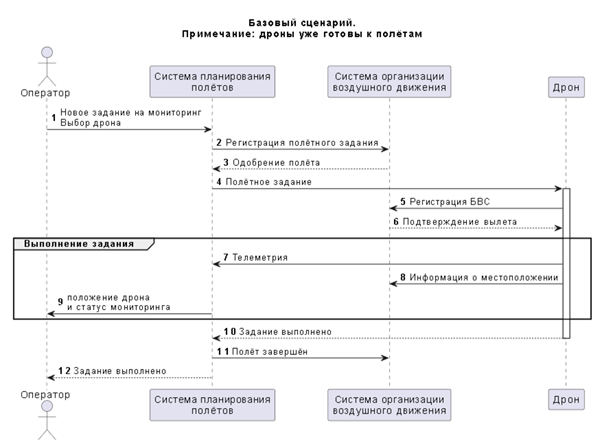

### Компоненты

Базовая архитектура

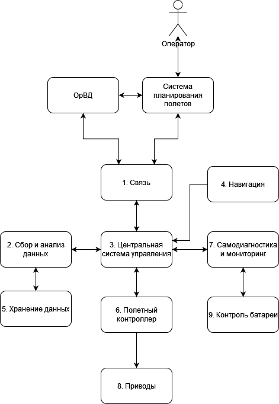

Базовая диаграмма последовательности

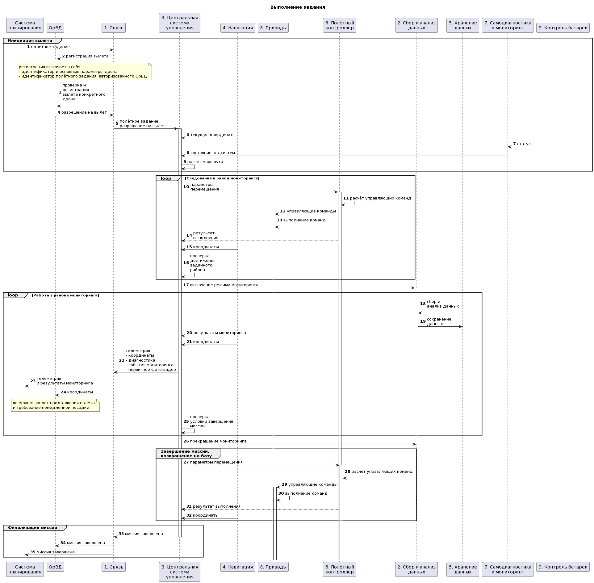

[Cсылка на исходник диаграммы](https://www.plantuml.com/plantuml/uml/vLRTRkDK4BxtKnpjxJP8_CCA8HwaDzxMb4XPEuhTIdlNj9HsbHKHAoGG4Zz8mBNhnCHDM_SLvhmHtuoFVNoyDb759HUfL7k-RsQ--HadusGIg2VqHY_eWKgwfNlAyIieLxIXbDRuuL-zVE9v_d4IXSSldWSpR-hFal71UEg72T2_ms2kpu2yetG_1DEjWPs2Csieb1-hmt4yzPE3hzuY-GN6R-XxCJgAJjotxxwZu2NJIzhers9o48MXQ_C-RFxYwFKPg5AwrQ_XDzNB_L3FtGZrEJs8JOP8SniTioQpQ1A_Z5tk3y3zizWNj0BdDmqYz3kXVWBJNq5UmBYajLw8MHpCJg9OkQOViIchhhz3RFUemGtKsr9fSi0RZa-V2WNBFnrFeiGbUK-akQPIdoegb8YDvE5_0pAf7rFh2o6PpgA388x7uP7ByY5O_cH9R0FqeECaclb7WGlzM098eIpI1J2b5K2bw5tGLZgYKF8Ql7XOYZhtj3BAJBuy7FkTU3u5wKzM22wcGf8fu2aUv5G8-BcV9C7ifUSTpQBZgQ8VnGMgKzT8eMaM8YA0dcq-DVfSMkYPeWTR0IexVK-vnrQmvfvy-lIP4kShQIT4rkycZ990HIVm0j1UrQg3EDh2-xVwab96uu7ISvXUuwKtKWXXNVKqpByMFQ51KsoeB55dqZqv9mDvf1Wv-z4BHMiH44snWyxLOKLbPmFiAHw0fdwRUhIjkHbXBmWF5MlW8NqZ7UjijW7wcTqYblsmNvNzi2sdgYQ2jcnieuEHpKmScPAEHbAbb3O2kB8B3PQjGZMLjKEF0k_g1ubvDxVbL9-Di2GWWAoVhJxNhmGXMK5AcHcW8S32guU1GQQt0OGu_1xGUOUujcSZCtAbNfgO99DrU_UrqKxYbM8mk-J4CQpSHleAltFspHNr9b4qnQJBnbmtnHT7cS3fXglHE-cKkgxjCeFaFLqhHoHdZUNPgtf9UmtE8Uc4trxlUedXWkBwebByJg9UEqHcEoEKNYZb3bJAnFOMYHIolWiwuF1jwNCqr3alkQhIIB_BX-Hxcgg_YuQht1r27g9cLVzTEy9Js_FDkDaIcuPmtTZB8YMrUyse8Md2Hy6A33I9wR7VA9M31YtStg9y26YzEx78O3J74NcrhgDgdxSEWJbqPgmkXW-ZYznTMRtOCH-FBsvOhHQPIpD0LH57lGJoVE1EZoHVkaPUPypH7wiOcldCyExIB4eSb98DHvIPErCsEzPUtg5egNYSNFOizmlbNc7boUVOHjYaqQkz_b0TbNemrZnnTX3Qno3rEC8pYV7QNN_tLIv08oipCZU2rNEPeoqLzYW-PZfvvOEq54Llgf3bjRvg3UkTRFWvJ8f_7KpZ8PTJcjPRTNYe3WF_81cV-D3HajIVMZzqGn4U6yaU0giapxhUK27vcEDQF-ukgF_rML3_vIf8PvZQ_K65tOFsMxHLFTMcjHzMraO0tNRiZkLku-vos8MHBBmlyFVunUGV)

|Компонент|Назначение|
|:--|:--|
|1. Связь|отвечает за взаимодействие с системой распределения полётов и системой организации воздушного движения (ОрВД)|
|2. Сбор и анализ данных|собирает и анализирует данные фото-видеофиксации|
|3. Центральная система управления|осуществляет общее управление дроном, контролирует выполнение полётного задания|
|4. Навигация|предоставляет спутниковые координаты дрона|
|5. Хранение данных|отвечает за запись и чтение данных в/из энергонезависимой памяти|
|6. Полётный контроллер|осуществляет комплекс действий для поддержания дрона в воздухе и его перемещения в заданном направлении|
|7. Самодиагностика|предоставляет данные оценки состояния подсистем (например, контроля батареи)|
|8. Приводы|серво-приводы и драйверы для их управления - управляют скоростью вращения винтов дрона, механизацией вспомогательных крыльев (если есть)|
|9. Контроль батареи|предоставляет статус остаточного заряда батареи и оценку продолжительности полёта в текущем режиме энергопотребления|

### Алгоритм работы решения

### Описание Сценариев (последовательности выполнения операций), при которых ЦБ нарушаются

Нарушение ЦБ (Целей безопасности) в базовом решении

Напоминание ЦБ:

1. Выполняются только аутентичные задания на мониторинг
2. Выполняются только авторизованные системой ОрВД задания
3. Все манёвры выполняются согласно ограничениям в полётном задании (высота, полётная зона/эшелон)
4. Только авторизованные получатели имеют доступ к сохранённым данным фото-видео фиксации
5. В случае критического отказа дрон снижается со скоростью не более 1 м/с
6. Для запроса авторизации вылета к системе ОрВД используется только аутентичный идентификатор дрона
7. Только авторизованные получатели имеют доступ к оперативной информации

|Атакованный компонент|ЦБ1|ЦБ2|ЦБ3|ЦБ4|ЦБ5|ЦБ6|ЦБ7|Кол-во нарушений|
|:--|:-:|:-:|:-:|:-:|:-:|:-:|:-:|:-:|
|1. Связь|🔴|🔴|🔴|🔴|🟢|🔴|🔴|6/7|
|3. Центральная система управления|🔴|🔴|🔴|🔴|🟢|🟢|🔴|5/7|
|4. Навигация|🔴|🔴|🔴|🟢|🟢|🟢|🟢|3/7|
|5. Хранение данных|🟢|🟢|🟢|🔴|🟢|🟢|🔴|2/7|
|6. Полётный контроллер|🔴|🔴|🔴|🟢|🔴|🟢|🟢|4/7|
|7. Самодиагностика|🟢|🟢|🔴|🟢|🔴|🟢|🟢|2/7|
|8. Приводы|🔴|🔴|🔴|🟢|🔴|🟢|🟢|4/7|
|9. Контроль батареи|🟢|🟢|🔴|🟢|🔴|🟢|🟢|2/7|

🟢 - ЦБ не нарушена 🔴 - ЦБ нарушена

|Название сценария|Описание|
|---|----------------------|
|НС-1|Модуль связи получил задание и разрешение на вылет, но изменил координаты района мониторинга, что привело к нарушению ЦБ 1, 2, 3. (Команды на прекращение полета и или остановки были им игнорированы)|
|НС-2|Модуль связи отправляет данные о мониторинге в открытом виде, что позволяет прослушать наш канал связи и читать данные злоумышлениками, что нарушает ЦБ 4, 7. Так же возможным изменения результатов мониторинга и координат дрона, но цели безопастности не нарушаются|
|НС-3|Модуль связи подменил идентификатор дрона при инициализации, после этого ОрВД ждет данные или отправляет команды остановки на другой дрон, нарушает ЦБ 6. Так же возможная ситуация с нарушением ЦБ 6 что в среде передачи данных злоумышленник изменяет индетификатор дрона.|
|НС-4|Модуль центральной системы управления изменил полетное задание, что нарушает ЦБ 1, 2, 3.|
|НС-5|Модуль центральной системы управления из за наличия закладок начинает отправку данных третьим лицам что нарушает ЦБ 4, 7.|
|НС-6|Модуль навигации отдаёт неправильные координаты в центральную систему управления, что нарушает ЦБ 1, 2, 3.|
|НС-7|Модуль хранения данных при аварийной посадке/падении/посадке не на базе(перехват управления и посадка в нужной зоне злоумышленику) были изъят, данные считаны третьими лицами, что нарушает ЦБ 4, 7.|
|НС-8|Полётный контроллер начал набор высоты, вылет из зоны мониторинга, что нарушает ЦБ 1, 2, 3. Не реагирует на команды от Центральной системы управления|
|НС-9|Полётный контроллер при критическом отказе не снизил скорость что нарушает ЦБ 5.|
|НС-10|Приводы начали набор высоты или перемещение, что нарушает ЦБ 1, 2, 3.|
|НС-11|Приводы при критическом отказе не снизили скорость, что нарушает ЦБ 5.|
|НС-12|Контроль батареи отдает неправильные значения о статусе зарядки аккумулятора, при совершении полета аккумулятор сел дрон упал, нарушение ЦБ 3, при критической ситуации аккумулятор сел и не может поддерживать нужную скорость, так как просто падает, нарушение ЦБ 5.|
|НС-13|Так как связь с модулем Контроля батареи проходит через модуль Самодиагностики и мониторинга, то возможны аналогичные ситуации с нарушеним ЦБ 3, 5 так как система не знает что у нас садится или сел аккумулятор.|

**Негативный сценарий - НС-1:**


[Cсылка на исходник диаграммы](//www.plantuml.com/plantuml/uml/vLVBRjjM4DtpAoxSPQm2IVfeZSB8VzHTC1Bh2b18GQGDP6SxSUn0GOKK1LeKI1z0cpMjHyKeDlqBS_-evnvTwVAoL0MZosmCcvp7cJDdPkX7QHOEigCdlI3hPhr8xSWRcSb4SdqcXOpbHW_bdTAd-WKUt-3nYHHuSFzZ9N_8M8zahbyf-E25VgOlQLJ8JCbRUQtkxpxOVRWJ1E5HbiH7Jnv7Ww2FRDrsjn_6cTf1Y0AXp-1rBVb1BBVoNd8J0MbA6TlVHpigJ5Mdc_R3hFtTluBy2kCVv4SQ7IR7_biFA4tQIHohZmPHnpTy2CEt1hu-GxnStkjNh7Tq4EjJ7wP-9hUq6GFkp44qeRD1qakVfdxiJn3x3UqBKljYxH67DRnVmFGtaZm60rCzf5aQ3OwJLFccdnbJAO7qDR2nKQ1m8QMj0MyCFdt24AO7_MuloVmW3yZFbPJwH4cXo3YAH_uvWatvDqBhSmRf3v9sbART-D2FyYcY_4LARbOAQF1EisGG7aQ-w-S4aCkrAHUEkKpWL9BlGXQKHQ7u6d7ni2GxDpAnpFI-xNJ36ful4VINAX56f5T6r5JmJ0ewFmwpB1ey3OB3GNBKL_8pKw0xgnufA6T84k4OE0MgrZvrjAVardL0IYFykUIid2m4nWhMHfZtxkqf9fzGJa3Md2PEiaWbnyW2frtc2JRwoGBPlzSNaXjlFC2imlGABuCMEWeer3JCdvDFSB1kDbWcQewvmNvhw64pPYQF7YgPaa28OaiuduU9b1uJUhIhp02i-pTVpRSpjtCSH7576Gu2b6-fCppRbG0zcxJ0SX0tit8GL-bKoucGXJ5sw63aAcCYsz9MYrtAPKu7jz6CPQLHjhDVcqtopNvbzD7cRQeWykqPN4prLGkh0ZHm2IsmQL_IWxM1K4uEl473C5YDX76o2eSZA3BluNfQ2xooDqPsy4ezifXOoRIw0QlU3UKlsOFnXIaVWylJSCdp00Ickq4lIVgOUcxFgHM2JJUckxmpdMcSUiaz0FjkiO7u1WNpgimCqtpsShMmWxMV5wG6lxhgzGY31jxr-PBtQwAUUe7ifWQKHbUPUQwcMRHtddiKm58_RfbkJDYgKm-FEJ9ZuItxZVBzU2o-ILfDMghQrLBL1vBxVhMs_sOYpg9JlXizrs8h23-Dkp9igTjnbWsMYHo5OMIJIAWnequblqlE2mT2V879R9EtW-03uepmMd81LS-bgjwxMW1x-Uo4dM--bBxdzlRguPOXkNk7Oxjbp73QALfsijKOWCyt7EuMwvKhr7LcOZHZfQ4TqZ7UNTYTgP-pPsLBnlRmbEjpwaxn9hHIt8akTwSt4NMdMJ1h5fZmZ9_B70A-rfULqRZcLZs5IV6VOs0pp7Z4yjKEswpUJXIsi-vnc4ML8AkFd9_gK1Z78TarAmDXvpAkPmCL_8mofDvj2wiFUWch_xE3gGpRkp-bS0l7VGLMkgUgOTqdZREXGrsEdlwt6ZTCuLOVLl48F_2lvZy0)

**Негативный сценарий - НС-2:**


[Cсылка на исходник диаграммы](//www.plantuml.com/plantuml/uml/hLLDRzD04BtxLwpAbI01vKCLGlqVb8D9hH0fjIFRhSIjIUY7r4fL4TS2FT2pQsBYaiJz2xF_Y3TFTTqDZGGIYXJPks_Ul3SpkrvFKZzEjxTwNjfDUu5PaJCfv8TaTYYbv3AtHt9bxC3kOtcEvLqfiV3aaP5pF1Sobip8jHJrYpsGqkW3q0YsUq2UQPmTsKDob58OkP1Ji_hGl5ZnF7yxZSBjhNT1xFMXfTlkzlqmXP9pAP5uYA2PP1iXian9Mo9N9VdDyycAyHEpsKtwVjf-_mV95u0_oMU2Ej6Ek_kt7XYTnC6c_m1_BiTZBONazaGczfZ0TXI6BkOfC1TgtWwH8vEfFMOnJpP2Et1Tsf5S4vF3RT4uLDOqZdh9XyJbNjK24r-oR_kt4Q6_OFSbe5_PmHm57DiZmf8WteaIuqAVAnIWgJs5Dau1El0BA_IWE_YXOgJG5lQxlIXrIJWbSYcLtJMeAEi9yyW_0TbYVVjnr0wIf1jsN9PdOFdEaiph-RadEacZsEy4djUBehwHRv8nyL1Rcnk6Nwbw7RuP7qfiLgp6N0ldDVbDw_KTDMiO_riJo7p7XJCaBa4jYD6LtLjkO24IeKsh4QqpER4ZdHbrW-eVBNFGn9bNBMt_cc7B53CcYk5tSSmMXiYZ4pZb51RiSAdJsRgNWElwdY7jN2hERmbaXXtwbKlu6Yh74gq0raSknzw1qg0rzYDxLhLq5IaAgLHjg3fv_fO9bV9VAzLmBgaIzqphZHxvjmqKfnFG0yfWBvqXC3A1k0egPdWzhCym4ymMAPjBwp_P8h_wwaJBUXz6QM2YdI1MZF5u4qn8zrEbglwC7g7YngoCUTovhxAmNDyCoAaIXnHvsTpAMfMvq0oYMGHs-8gnTW3K6F9ABmWtZKfoPj8v0RM8dCF26RCZC4ovLeAIahbTVs5OkXalrW4WJEDvw_Z7b-ut)

**Негативный сценарий - НС-3:**


[Cсылка на исходник диаграммы](//www.plantuml.com/plantuml/uml/XLF1hj905DtFLzpKvNibUJ5nyHOl_8UugD1W4vWsPSeQqA09He9nuKOJDwuhqXH1wY_S-IFFdH8e4VCsCyFSS-QSUmzjZqoGccmuK2OoWv0y_i85_-JSpdZBQpxO1VyYExLpN1zmFU4jBfwsxeY_yTekkRJlMmGMIlQrVISmG0hYxxoYPvvIGMPYdGrVXgbAe1LreoJGXZpmjtXu1iPlpZkQ__2USs53f89sVLvw58oe5usIm7HV_VF8Lu0_yYS7wiVZo-fTg-7IGRgnra_IiATKFuspXFYp4vd3SeuLSWJy0auAEClLMPVy1yU-9nYjU6zN01nmGgibl6vglrmeGP7_N6HUF8YfcvjxWatCjUuOvwjYEZOXnMDeWNJhrCYP_I-PTp3omRw5Dfx01Q82z0UAoYUusKWUagLzWryxbsjb9oWHzgbhe4wvaBuatnnn5A9Z5yGRoKA2V-IvYv70QjKS2hpU4axh6WrcUGhu13y6gKBT8nc4mWnavjXavAWAfS0EMNZfwEjJwUZcJ0beyRyJyDaTGAVEQg5Zkhxleigv54Bpxmna8osngTfOyEdy1G00)


[Cсылка на исходник диаграммы](//www.plantuml.com/plantuml/uml/ZLDDRzD04BtlhnY5O-j8WCGXXwh_Wt0mYLKYjUieNlVS5YX8GLH57BY0r0ldnObbanBp5sR_4M-cfav4KNknz-EzcJVFp_kPYsSkFpeqRk8E4-hnLovvmJwSSSq5hyESVr8u3USuNkFuX6iSFEq_8Rx2fkGbU-BVNFxTX7TSaom01pkyxHDgWXXUX_TQfEQI-3jVqhEUCN7kKfiVlKncPWebaz5a6bi77LTSe-qP6B_O3orQN6lD6eqQBjhrHO_YZCQJR1gxqQj_Ydm3-1D_Lj11Uhnz-z01b9tDad7y28_j6e_x1AL5kE0gV53WABNMc8DPca-9lwZ8SupiyOHS0dQEIKfCvasdcw8zPGv4IiFNuHA0DLQmgcBVoe5pHb22La43KjMB6w-mlhEDGYbwBl9Vx8aHEpk3Xn1jwX9AZo4Fd5qLIEh1VycyWlQFiD1B2HmWEu3-mAM920Ci9G8Ihl06kvK6hGadk2AyJsNcDdQbME6bEX9GIfym9rxgvqSIxoctxUA2cqqVeNMNi2fkq61MjvcwXRVPCOaTanXXu84OZvTyfJQ6Y8sqXPQXlTkLeTtqb80M_Ii1T-e0wYRJHcqWecX0wa4bXCq_24ZgAejCiuy7_kK_)

**Негативный сценарий - НС-4:**


[Cсылка на исходник диаграммы](//www.plantuml.com/plantuml/uml/vLTTRnjL47tVNt5L7XiZjUK38bJrVr0Ujea9bjnTozv4wbi-I9FA4LOH4WWfG2NWUUtOUECccxymznznvkokxrwpnefuvALIxywScJapPyPvDaZ2VhB_iXiadQJRDW_aKcPo9QazbamcSck7SctiaNsDvriy7qg6Xuy-DFAdljXZlAJotbxmwmYcai7y61zl93NsHEveCP7tHCZi2BwNYcHFx7dn9ZE5UsiURPd7M-R9Wo08zvCusd_vejqFUaYmizFfXL62zDxLuPz7SWVSbBY7aYDAMiHuOCA1sUqCUc6oyyq_G7w1yVVo0utsuWF_woFazqucTYHpUq6JdJYAV9idw-f_7jaZFyCc1YhKf1zt1wy67_JRkpw-ydj9dupDUBtqYiALT3-3wQziomG4JEsGPeDs_o0U6D_q4pML7Dc-HNviBHXSu8Lrw1VDqHuIGblGwtJZn0TvJ7h6ajj38vaXuI00yUS0c_B_WBQd1EdruvtsOD29zdoKZu7o1scvhKQWmNkGnFrmh-sxVie4KhdHSk6OoXMSSdAUoO9JaHb-1YuUSx9pArSbCzslTplXIZwV0_JdEX7smiXOPS2Pdqb6vnTXahJxhu9Whn_lzupyn13eJjKZWy4PaaGu1cu0JUifnsZRo9thWEGw-ND9MJbP2DHAhJ6N3nzk6mQ_uaWXi-OmKPoqJNo0A73QAiPrhPyi4FqxUoQfUkC1aeNf61-3ba4AqsAkOVvjmISfPBELPMRDnQ2vtoazRCPCuzYXaIa9n51iWFDvk9BSOyAEjemAODc_UILlPrxAE6X7kqOv251-IPtoN6u4pBE6HIuGOnCh46sTJbCeGXPgxBA3aQkCWSgMjbhiKYfpEhYLffQrHYqxwuIF1c-Q1-Qy6TjXcYzQM18WW2jeWINxXXwi2bHIC_060SEW4WESgjc68yZHxt0zMW6kxDMeb5nkHsLEh6HQttzrxzQNkkQ-gfTVy0RZCoqVakLLEETbG0RQrw0RnptedRjpkXm1XflGNQwr9urwbzHBuAbRQI2-ONPvJcRADD_ULEiwMFfv87xwtgcp8qWClDlJWlSRPZtrWRYZEGDDhZBpNDaijNUUsno0OdxS6bqRiBLAFJpcY8nLL_GRvVjuBBvfj1fdgMQt4cfLYjpqrSB-Yu6eGZVvJdIknUL0-67SVM5BtNOhsM2PY94f8-k6X3EcqsdaDqbvsq28Fs20QlOsWSl1puWYuQ7axgbVIbC_TJv0TVHAYPskFvA-v-R-sk46bTo_nL6nPgZEKaP5ArkD07nVSxDRh5V6gEjOCPfpfM6fqWc-dPLB4ySbLyEMllBcvCjzwwxmkcmbknzTxaGt4-LVP1FmfzcSQ1ntxdYg0abKyfYgxfmSweSX3JJ3O-OuzfVWRL6BJ5bL8Pnh-jeZgcaXcJkGzz6ehd-0wbi6IARCp_Qy9jaRRliZc6J_AiyomendDQrswrfL1RljS2Vf78JWqO5KFxj-N4s5E2wJBIHMK3vPZSQxEUP5FRdVTJ3_w-DW_ijju6IKlVjTChS7tU_IMlTC7TRzo78sT5WTHr-McumRbyC67rRn3F_Wp-M_0G00)

**Негативный сценарий - НС-5:**


[Cсылка на исходник диаграммы](//www.plantuml.com/plantuml/uml/hLLDRn9H5DtFhtYf6qsbHgqV8SRqVrWN8qpeHFg6p4n9t26rjOOggJ5nLRKBNLCAPHZAz2_Szuyyzz8d338B4pSjt7VUUUUUUzvZAuhTCDxRhJkn7zSzjKQdDAGBwfas9TIdgUdGM9ctvX3bASejIb1ujA7e5rTC6vKUJSonh7O1fGJmDXQlgAVCFbqp0bGJncEnYxsdp6JspT6iHaEcEr6RTzMJZJN7SVVYGE_jll92fm5vViLlk3g6kBD5ycrDrs3j2MkBCkhVVEwkAJTILJzgk75bvo-IRm1_fYy2gWNDfTMleCmW-yfqp94LJQcWTzpAwsMw-sZdZFgcIoDpBAXAe7KUyx38hcsTzmlVLnXcMUCmg4TlebkXLytpRxAbiYUHsHt-sQNTfVwU0lfTfjY7OmFJ4LZaXSqWKddeOuO2D34dq2T9WEKfAj87hx16qn8Adbd3hmTndkI1s7CEIrkA4YKJWW4uVmIoWNm7jJaGaaOOLBmeydKjpy9v-ocsJ6rYLkoEuY1qQvxZpBrIfUSBfElhPOM-KxJqoRotJ0h4GxgaH1ABFndNqN8cFatPKgSU10r5FwWdlRGPs5UYQ2puOS56vSoFpuifyrsnng2R1MVKOcjv0jkaxCxCmR8fXJknTMvBUTRpoEnp5haTJBHJq4BEpXUSlfTvBW4cd3hRWCqWyloHKYZ5HGNrc4-wnyiy0_mTu7-ooF-in9459M8c6WP2BlAATEYoalipaJiqb6pAsQMLD58VYDOBr3AvVGcGFQo8gtGEzzhCKU28K5npzFdA8KcWuHozasXa9QxYY25bsrgLRYvu9ZWSf0HbRtdAmxzDezNFpXrkMi_RdRr0HGrJygzprHmf-rB-T-9QK3HA7SIU2ffUo1Zbo6Cq4hPBRbr9Hc0HYr3o0O-Ll3YopgfGjeyJZcI5RT5uFlybu5ivdVM2tMAgZ6eiUp5gcq1FLnLBoaKi5t8heYzJJsTFDHWcKaj0AP9bsVwiYNDNCdwyyhDZ2jycFa7qfnmCyy5UwIAFgvvRYVsc6tkBh-OMZi2l-My0)

**Негативный сценарий - НС-6:**


[Cсылка на исходник диаграммы](//www.plantuml.com/plantuml/uml/vLTDRzj64BtpLopSOym2ITgqDO8W_wFfWR5PLu122Y9j83ShgMi7CYgaAD2YG3y2j3dJibZHiat_XTb_rBUFf9QhKXMC7dCnxDtvUFjctWpzD4c3ONhmek-blRGVgYtvLNAva4o_aaAcSgF7SgdqI7-7uniS7qc1WqSVAnXcC2YCCMuBFU4PBFHhVKhhGd8bx-Mjkh_zOFlXbkS51saS7Rnu7Wwz0TBsTdk384gHz1tyHqYPoxLapoAvbIl9J0JaAsLQ_pxPKa6Yzdh984Xtl_bNaDzW_8FyIAFz-D2zlGzqxsIg9pBNPpJPZQF8jNa8c_S6kNw5K9bSwJE-UV8iqYCNeNujjxIP0cbkqPcewJ3k9oyJD_OdNOpH8meErKV3SC-r_npslvFjAHYOwJ5jat1u62VADNraJAK4tBS0o8g1mWLE-11pOq3g8uOmDHZq-d7g1db0Viwbr4TA2aN6mG3opn5inhyHMXypo60OxuP9qelstIYV8ifVvEMcwO0ExoIDXy5-wBf-HW2PN9ldmZ6J2pYL9BsG1TkYKBn6N1oMPET6Bcfc-b_lzO8LF5yWw2zj8lIPadDsjsdbN0ewFm_ID1o-zBpzONmmKF8pKw14JQ4KEcTC4k7esGvK_XFsqOwIMri1AKtZpoNZoyc2PwoCDHhpthqTnUGNx2aWwquJnMceuaDaWTDsrQzh_MI1xD_h4ycCDmuWMfYUuzBpKL50OMF3_5lo2GwMnGRBH4sz6-otfCSK8pTvz5Z9Z0IYAJQ4StcuaD9XGa-sbL71idxpHj_MlDQn5qPxod3WuVarTORdUYIWdqrQO84QkrY1QjjqgaeHiZ365XsCxCkOg2wfxxDAcSpfO2UQiMmLQbbPgtmKU5C_4FFcs3QcUlob6H9V-PWNe86JQ859-uP-V1i8fN8G0pIClKOIwh7VT3WSGP6vX-l82Uyl9MICQk6LUb8ZutjcxJ7OzlOhS6qIAlPWV698W72v6awv7e30LDVhn_60im_IvnoTBRk1EQUC8PUcF9tIbyn1ySHEDzIWeusvMd93Ei_UDAFRM_evGLRUq1xwUWArWNnzN95_JTGpDn37DTkXorLonzLKZFRMSwVg1RQIdQXh4_gh_CDZZioOUbNHyNmt7X_ljW7xgxkXMdOhgLPLoQ7VpEw_cOY2j2Am-hCbhhl2JMDN3Kjg1rtD1f-978LXP4sJj1lj3ycuva28ss2Ih_Es45n050fN9gTGUsUgzj9p0pJhhvRPyVfrwNfkBgyURnR97IiSLQE6ugnLL5NIxmp0ypNRs-TxiP76N1kJRgmqh4KwnTr9FJwnPafZw9jJRfzoENdjFbw7LegxqXNPcROVhwFBsT3AuwVQd37Pyvpvb0QWD1gP6V5PJRGNHUO19q5ZSRkJyAPwaSpujaezb_JL8qfg8OLTc7SHgba4SiMp0Y49cTVwjANRQyxz4KoA_zHedI7dcisQ0RjUMdjXi9ls3WFmQ8FmCwpHwqyk7WPhmza6kehtwMfAb8bVUwRiTziJweDU4-f_RGcqHrr0-LCAEnBjnsghUgeTrdvvMHiwhFParlwStcpSDISs-F0LJ_43_nh_0m00)

**Негативный сценарий - НС-7:**


[Cсылка на исходник диаграммы](//www.plantuml.com/plantuml/uml/XLNDJjHG5DxtAKx6k4ACFoWwCORtK1TbfcBZq4xQ2max6CAFOfomCZ4XwaBMPPY1Kc1uXNFVoE-SGgTN1jsrlT_FETyvTsOXDNvYLfOxdWbD9w067_28ZpcpFSvvm9TsZy_8RjXjVBx4vtNEyM7-8V5lF6TygTzp7X4FzHKCkuNZ0m7RJRix0HpoFiqzeFc6v_ah9evMbXU3nEkYWB0LTlt8KECfc8V2i3sLFxTVrBR_Dh8RdAEG7aulECFx9byfPi3dfOVjDyXFgHL79eaxwLhgQizfLOBFjSFjYX7vgovK-ll56Op6Q2l7qp4CncgVSo7sd9CUYsyFHmW6pyUgbmQTz-tGNt95NqBqkp2qjx7qHdmaKMkk8ywLlEWR4oHhBlS5k3_KOo0bsRrhdsGrJic5FXUeokz3MGU8QekwiGHcrrL21j4DEx5nHPve04VI5w5JdIoc0VzJYDKchIBT96u5QHf6VtNyxFQQJ66d9axyfO3k9K7RvVCtM8unw0k0Ts_6p8NIFlYjZrWVRp9kcdrTAsLcfab8gq0GN-rEjOMQz0ddiaHJ9yYPrudZBl5FpZI1dW07f7sSANvq5t7YxjRIn1MgqaG4jJYTU-CAt2GZR72t_f6aomHraagpRFaKCMBZTDbwTk-E3kfflfgLYz4atHt131MbTEzwIr5bjUr0dkgbx_EG7Z-wxzqSa5EFTfE968GsR9_mKd2XKvOI-sL5TyuLDbVQKI5vs4_LPF_V4NIgVM-Axq16gjWpxQmFRP3B-WgGAxXmo-lMf9OQdbJ6m1TgUVq3uOOuM_C45AnphznTUYCh_wu-QDa8-rapg5eQbh7S8fNlqDm1UjglCF5uUYWZBuZQNZlmMoPSzKrGly3U0ixmX_07)

**Негативный сценарий - НС-8:**


[Cсылка на исходник диаграммы](//www.plantuml.com/plantuml/uml/VLHDQjjG4Dxh58ExJ1neKqenfUGUTHTggeL1UJAI7EWkLcZQebAH0uJIJTUg8YLA6ibNcBbHlpTObKmSOp3uwNlVppTZ7KMn6yQB4z-9Px7lqOYlkE9hpYNXcWjk9EKxagLSuBZ1yHdNE7XzGFoJM_uhbvAiGNoFWqOIGF00dqhE0Bkob-HSlYf1pHNnRxwav_lqOfyEHuxZBkB0B4u-UA4pXvVPyMpkcfX6XmSMMQqfSsXzLmVPrCYIQtXAyFI1S_m-vvLY2iYgZ6GZSYCw3amS1dxqAThaVccDARxMi1V_RnZtT1EgKJLsWLobf0gBlF0qY6WJ-kfnArEphHQbiBddCp-8wLdeVNGSFmZcHFnB8vG05vntZHMayUui5I5pgnaJRjLOOpCuVLOQl-tPz_Ocn2kTN8wRbNKYANojh1EkzEnRrvhJkng_ixxU3wWcwWB5Vx41QTYwPF83BBLy9WtyeDxBBNJhwc1hAm5N6mIIEef7fkucuXIeTgLrDlrMxPJ5xRuVpL7nBVInL9BORP-QnwoI3KjzCxRBCL4XBRxKwd5NqW6k3peKrA0OgNP-RtVMZbXtkEQRJWwdjqXGQee6-6jkfwOV_TDJXW9gxFwVQYkZjG38L1gokyVRkIorX9k-Mj3n7ysSQ_cov5PZUmQBUuHll47-0G00)

**Негативный сценарий - НС-9:**


[Cсылка на исходник диаграммы](//www.plantuml.com/plantuml/uml/bLJDQjjW4BphAJvSUWe9BVqtfUGzcXwKH2q6HJAI7CWjTcZQubAHQo6KNdfsPAbHNCj-XTqtwkpAjlmbpY4OZFLzExEpisFjneaR9RqZtqawYU-P5brIGMCQyO1AogZY8TqOxlCvZYiSdrA9WpSxXdxHZFxn1Ghh8fhWeE81Id21Jy6dABiK49_nLoKegJ3qXoxCYvRZkBqa37f7-rxaTA6YSz3fka5YMizsfAPOa8tGvRlsJlS2xbC9DGFSJcc4vpEQQqs6Xjg0qvPnOtCG1aaK-l59R7E_0lTlr4yXCgSIlyP0pPIpf8bmKcdq6cGudEd85OsLDlRyZuSTzvDDAdRyRAONmOQkn4HrhA1ImVjkadZHYOrzhXx90ANwVhuQ8N2FxTBNuhhAoKGz3nUIekCmDdRfoxiBmc0RDgGKieXknmyJyoZo3Xt73yEkWK_gQOxYZ4RBvML6_RuHgeq-qSXfp3VRxnhshQsseRbQ8WieH0aFeMikIgZGis_BDJehd4NIrlxOrnSPpQm7W5F-0Np9d-imJbLrRXFLTa7AHYWL5fI7JbtV83521ZldQc7LXFgUXi0rRgZsWgxH6H7HT0mm_Xq-JjSjVBijKMXh2xKvLwE1vQ5jjTLAXyFgrDiwsFagw7-NZN1w3TMvAgzGFwRPNj2i6DjSn1Ryg_Y37IXiBwNSF7tos5bUt1R1VIL7GD0uDNYOq0JZJzM2jCxDVNb15ond-TBHaK6X8wXS6Gw3hTlzNWBymUO0ZgwaZwYPg8CB6pOXwoq_D1qr-Y4PyGByqNRnZPVlVm00)

**Негативный сценарий - НС-10:**


[Cсылка на исходник диаграммы](//www.plantuml.com/plantuml/uml/hLJFRjDm3Bx_di8gnss8COHGXT3UWt8eMm-LigHAqadSjauCK13L7c12N7OEMSAoTKbVmNuZFhk496X87BXKYlFPtnyxtO_YSHZFZpmNJsDlGWE-v8AlEPK5bvnn9GdVafpAESeLoYTSeh3xv37nLtl8kEPS4ZnVwcivauy6BRaWlk8BsjscfzkqDt1kF8y3VtxqTXAw6LYd1zFPs8zfi8VcAssI1KQcl9BFnhKS-NBA9TWNU7lFAPxFU6sOZ5SR6baEQ1pHGU37OU15xwB-x6ScJF6bsJh_tU6FZ_lG5tzwCbWq2O-3Y1w5ayC-_Bd20Lp91VHPK2EVxr0n7_f6DSg9ZL7liwaNnEIS5mGp8lvc5d80CqwRn38oUxSwXk2vDeyBharOfHvSwvLsNhMJjxQ6n6lRKOhEGbL80arhLS65rJurgRbMKNV8qFWH-GUrHTsyPIbVq5_AUpARzwOwxm_Qn0Kf3xPoqMkLnFsAT-Ur1locwOUH2f3lQXkPI88xgE4d8IvnZJf34xRBABi2eA1DnxmKV0CbE2b0STM80-DuRUkfcZ2waRxSqTCOcb2ZoItuLEaxk5Pobz0iOw6M-9rUBEUDJlxHqA5w0tkvfL01Vytro6yN__STWm61Dj_XvYkX3O4ECshGFhIJVstz7nkP-8VExUCN_om_0G00)

**Негативный сценарий - НС-11:**


[Cсылка на исходник диаграммы](//www.plantuml.com/plantuml/uml/bLJDJjj04BxlKunIzOIeYleVLHNlKNemu5QHZ1tP3X8t4bJQAbKjhfLGrGjd4vnYGkoymkmRzPinnd4KfFQ2yExCz_FDPBUZs0dZmO5dubxikTJXSvxo5QTsn3bFkB1ZlY4xjASuBd1yp3aEjhQU4F_IZmcNdDanli_bsfxOhrgQyvJuWi_eHSSOPn07_k1WrmrD7tozlLxVyMFgF4FRXPJR4S1IlhNVbINPyUsGS_2ES3ld5DydlD2Q2TzM13Rfa1FHNk37OU15Hr4R-nMmVwD-BW8X9uMjWal5p7acc9oJNWlOY4lrK_2LmaQkzt6_vtngWxu1w4_fKC6b22Q-rBXW7hfoRTvrujWDZzgzpoKZDP1hmgVt5dpdi5twUZNUEqdXOH3Hez3TRvU_b79LSmOXEZEOcothbD3iiSB8CFezBuZ962y8-eISDDECI_2bzV0cf7dV2CpQd3WrJVYq-Qv1tjZe4Yyq4Xd0L5JOCJGjH0MevEnRFKRJA5e6wIe_vlL5RD7o0jZ4_a1_RZ-JsfohwgmDLCK5AMjRuR1fbOXDLTzqmi84KIuqlg9PwWS8qTUa8ThHSGrch8XknmZsL_5WVZd2jvko2bsbq9Wp3HgzaBTKjqAbvZ0wpRPQxEn-qV_KH3YzXkfCbHTSOdxbZj-C6DEyMrl1hzU_IzA5wIMSqTRJnwQ-e5M_GmN7We0u8NpCU0RxSuqWgVRceNq12uPJFo_L4q2L1PKBSsAiYVkVkzVqDXF-tyruBp-z3qstKF6b61FxC_cdpbqUb-h14LLoBWhNhP3hxnkpZRzuXVy2)

**Негативный сценарий - НС-12:**


[Cсылка на исходник диаграммы](//www.plantuml.com/plantuml/uml/XLRBJkjM59sVhpYYGn8aeFI1KCL_D1sOn4qZ1Jko7IHcFCe31JMYwg2gHAyOt3isINnZyaX-OPy_kklis3avmIYpSBBMtckl_GZ7OUG4KVkqAQ96r7Jb5ZrJGdsArHMbrAEfwj2RL9Vg5izJF5zGYeVTlHr9_z4Ctr_XQKPZzIZfbMd009i2yAm_gsjrpzoK4abVw4dkb-J1bX1EE_Azzkc96uWMD3IgZPRZHL3mGYaINe4qeRZYqPp65Ei0dAcNVUvkIIUKjKROSgBg7--2_0_mt_GFW-h-cVtjBiIzK4zrQQWU6LBrFS_6xEzejKbMOQmhP0Ew5KzTsWhLDSqPquFInAZJKQF0RuRdeHtxUpP7urFs-dR9y9mrgJy1-ebTxw7uWUemB7I3Cp-KDlG73ULUF44RTmxkZLQxfFMf2mwXxMyrcdva1zbZQrvffYuafPBDHl78FqIm0V-DqEg6WxG2l-g6OSEhsr4E4EKpMpBDUr_03YC_SEgkJVsH1SGqqUM265CVf1dxdTA89oAL_3NYud76xaofdpdJ_BtMSDRq_BnnN9byuaIH6vpBxmAt9aGzyDijIVzo7hGeRvJ4v7JOIR25cK1P_eNdw53ItBG1dp3tGugvVBP2Q9H6Op2tjmybA-ZpJ45USHhFZrpfdo4BI2NE8pxaqGZP_r9t56is7h31WBxYIr56Mo651nlmFzbK6B7iEAncrRpyMlkSFT8TINGUrP4qO1Sn6Hl2sJxqQMOveRebgRTWsSHXljy6dksnSBsQr1u8b9zPfttEJWA6MgU5befNx4h5MxLJBjQ2HXfir05aAkD4MKlBPUvIJ4Ccc8EcaIkDMdRMR3uQl6aUMFFcs2QcF2hZKi00la4ZdDW7Pd1Li98N1smOq17vHiYZN_LS_rREnnnqMAHH271fXS-HELT3insSgMwcZwiQh1x3bHYs2Glt0BlJ9c1x-PVXddyTe41tLpHzluNLvnCwM0u29-endTvqPmfNds8xjRbkiBzWWlbN9T5-yzj3VhN5acS5MPE_UkzL5ui6zzNDmlq9gnvOWR9p3Ic5L4eiAhTCumtpS346F4NcedwOyBtr2GsH6LTlqM-KRyVZuei6h72YFkxo-aBoqSzlzzSy4LwNyszMpxGu6mXpytW7I_PvfXU46qjmHde3QC85TiqXorUPFGTiR6w8ECP7_DFp3G00)

**Негативный сценарий - НС-13:**


[Cсылка на исходник диаграммы](//www.plantuml.com/plantuml/uml/XLRDJlDM4DtxAQxI9KabIkaFgYhUetHX4ZUD5Ep8Tf3O0Ia_AAWHLHTL9Lgn-5YR9FuI4X9UOUuRVMV6pdKk66LHARq-SsRcp9dXsuzYDuoxHsqdRiLjJrNedb8QKQBFQKf3MkW-FIjzfY_nlC3pAKtniBtpjQ87IkY5bZJ6KuAO1Iq1vBWP9OgcYh_YTOgtfGGkQ8IuUwRHFNtDb7XD5JtIdTgfgjsAuxZTEF2xHuTUw7HGMglUwhX-h2f8DnNw5BJ9WK-lDAT4w4-HPfZ_7bIK6wb6A-guSVttToJ_0VmN_IsWPd1iVzsMfePwG1DzAv1wuFisXXj_vCBrEQWIckjRqMLmuEipkqBTerV1355fQgeJrZWCsj59P7D_A-8mVYeZk3GHllkcr1y0_Lyq7V84T5zWaHSU1v6oeTyn5A2vlaDjCb2eDyEBzC1Vk3vzAXGiVwVL3cARv1kHveddA9DbiT4yyaz0DfR_1xM-499E6DIzA6hvJPjb5ooVH9B5QlObqL4SX6xJiqE_tsGu49KxBbUc_LkZvJRLLw7Ni9b_1FE_wsheMuLEiG5YzvIcmd3enh4NdYZ7QOP1jwFe7qc46QqcfM2TlaY9IAUmeAhzB4RQK_HQp06_OFm99TA_QE4m2cXsvjRMdfBi8p4LIYjFumUnfu9ZP45GDJFiXt4qG_O_zHKb78q7R3QWJ_Zer1HA66VE1lmFKHKYc953QwuwFmefcc5zP2Gfvz5zHMDH4DROG6VhCAAbfOGUL1MlWPdYn2ouWUUBx7X-Gx463jhFfMETyvi0L-V7wC0lLmMsMPDJPNj1CmONrG5KT2Q9yf7MQZAbX2OSi7xHW5mRb9biiVeOy2O_ICsRkGjEzLCDfm82o16QuSRUI8Hq1IbbSn0D0VgEMGa4vUP68CJXxmWziuX_uSNvjMOMYQ7v-Ytr8AzC-Xclty5r3glzJ3V0hhXzBAxyKRZ6VpskWEVgj8EWWwsNwpas5f14mqpsPvv9wTQ3mavj3Xk4B_6k_459MMbvkraTRCV4MIHloby_zNg05OFk-YBJ_KMg7bj4-QL6AQMXb5gXCYp65v5xcG74FyKn_J3XU-bJsAh7jowRDzgt-QJv4ckLU-dZARzTHLubSxO_hnBXjN2-MRfYnBaXYcidsrSrHrckEZs0RguGCsFlquiqE30dp9mdqHomUN4zd7tyn3-3lW00)

## Переработанная архитектура

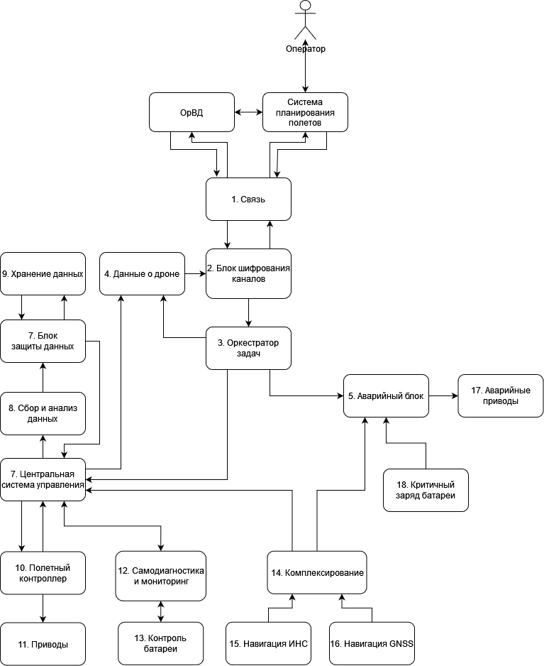

Описание декомпозиции

<table>
    <thead>
        <tr>
            <th align="center">Исходный компонент</th>
            <th align="center">Декомпозиция</th>
        </tr>
    </thead>
    <tbody>
        <tr>
            <td rowspan=3 align="center">Центральная система упраления</td>
        </tr>
        <tr>
            <td rowspan=1 align="center">Оркестратор задач</td>
        </tr>
        <tr>
            <td rowspan=1 align="center">Аварийный блок</td>
        </tr>
        <tr>
            <td rowspan=3 align="center">Навигация</td>
            <td rowspan=1 align="center">Комплексирование</td>
        </tr>
        <tr>
            <td rowspan=1 align="center">Навигация ИНС</td>
        </tr>
        <tr>
            <td rowspan=1 align="center">Навигация GNSS</td>
        </tr>
        <tr>
            <td rowspan=2 align="center">Хранение данных</td>
            <td rowspan=1 align="center">Хранение данных</td>
        </tr>
        <tr>
            <td rowspan=1 align="center">Блок защиты данных</td>
        </tr>
        <tr>
            <td rowspan=2 align="center">Приводы</td>
            <td rowspan=1 align="center">Приводы</td>
        </tr>
        <tr>
            <td rowspan=1 align="center">Аварийные приводы</td>
        </tr>
        <tr>
            <td rowspan=2 align="center">Контроль батареи</td>
            <td rowspan=1 align="center">Контроль батареи</td>
        </tr>
        <tr>
            <td rowspan=1 align="center">Критичный заряд батареи</td>
        </tr>
        <tr>
            <td rowspan=3 align="center">Связь</td>
            <td rowspan=1 align="center">Блок шифрования каналов</td>
        </tr>
        <tr>
            <td rowspan=1 align="center">Данные о дроне</td>
        </tr>
    </tbody>
</table>

### Таблица новых компонентов

|Компонент|Описание|Комментарий|
|:---|:--|:--|
|2. Блок шифрования каналов|Расшифрование/шифрование принимаемых/отправляемых пакетов данных.|Работает при помощи SSL протокола. В рамках хакатона протокол не реализуется. Предполагается что в ОрВД и Системе планирование полетов тоже реализован данный функционал. Если это 5G сети то там используется ECIES+5G-AKA.|
|3. Оркестратор задач|Распределение задач.|Записывает индефикатор дрона в блок Данные о дроне, потом полученный токен от ОрВД при инициализации. В аварийный блок отправляет параметры полетного задания: зона полета, высота и так же отправляет, если приходят команды об аварийной остановке от ОрВД или Системы управления полетов. Все остальные команды и задания отправляет в Центральную систему управления.|
|4. Данные о дроне|Хранит индентификатор дрона и токен ОрВД|При отправке данных дописывает индентификатор/токен к пакету данных|
|5. Аварийный блок|Перехватывает управление дроном при возникновении аварийной ситуации.|Следит за тем чтобы дрон не вышел из полетный зоны или высотой указанной в полётном задании, следит за зарядом аккумулятора чтобы хватило на аварийную посадку, при нарушении совершает аварийную посадку (снижение вниз до земли)|
|6. Центральная система управления|Выполнение бизнес-логики и полетного задания, исполнение команд поступающих из ОрВД и Системы планирования полетов.||
|7. Блок защиты данных|Шифрование данных оперативных данных (проанализированные данные) и первичные данные (фото и видео).|Аппратный модуль шифрования рядом с хранилищем занимающейся криптографией. Отправляет зашифрованные данные дальше при необходимости. Используется AES-256 (если нужен отечественный то Магма), но в рамках хакатона не реализуется. Ключ находится в Системе планирования полетов. Как пример реализация модуля: флешка с аппаратной криптографией.|
|14. Комплексирование|Комплексирование навигационных данных.||
|15. Навигация ИНС|Физический модуль ИНС дающий координаты дроны.||
|16. Навигация GNSS|Физический модуль GNSS дающий координаты дроны.||
|17. Аварийные приводы|Группа приводов достаточных для совершения аварийной посадки.|Нужное количество для совершение аварийной посадки, это выбранные приводы из приводов имующихся в дроне. (не добавление ещё дополнительных приводов)|
|18. Критичный заряд батареи|Проверяет остаток зарядки аккумулятора.|По пороговому значению (которого хватит для аварийной посадки дрона) отправляет срабатывание(меньше порогового значения). При реализации в продуктовой системе это физический модуль, подключается к системе управления в обход самодиагностики сигнальным проводом.|

### Диаграмма последовательности

#### Выполнения задания

Общая схема выполнения задания, за счёт того что она большая нельзя сохранить картинкой. Прикрепляем ссылку.

Ниже будет каждый этап.

[Выполнение задания](http://www.plantuml.com/plantuml/svg/xLbFRnD75B_lfrXnCgAkIak1eghYrbilN96YnIo9LNjjsHiaUiAXQOgCI458HPNw1wdjUPFOZMCIvolCVAE-tzl9UDwm6tkZA9Mg75eHp_lztfltvysysRlzDEgbw-rMa3RJLXnUKQ_rK1shcNglZjIO_fkeSQZsLQP6AiEVUljA44JhQITPRp-8Uq6NyCr6inibAQ7VaS10Rn3oK6Nt4s9wRs1FYNFNKeHHFtpKxNletqZgjNh3gr7Q3kJozOz3uj_LssfVls2PHgVTNa-QZIXjTX8f_2a9loBbCpMzduJwHzBwlRI1VbPJ_YDZkTsSSgtPNVEtzHcHaMqaFiRkw5yPxN6cduB3-4PlCVvXb4OhKHArddmNIv8RHFA6zHsHYyU0pa8rWb5mTOxkTP9u1HmIUvEmVoCSK0vxzGlOpPlG0-dpK3zJnoorI_iQEmvlarsh_jwkVqBSloFW-XMHmBO32jmKLa4RLi2Zdp878jzjjZgfnt8TB2Gz8QqpsjMGfVjnxt6d7tgoYCqxikyGaeJ8r1vPEUDDJ10JqZy9iGpZuMacFb9xJBeMHwrqRQMn5ZU-zPWHg5zSo_KB-7c7uvNHJsCrOOu7KPh6lISU_3RWq0L3z1QYhQQa-G1H9ZYbtkXKlfL6hqbyKSiZlc7iEaH146Yg1xOakCIO98aUUxZF2VSh8aaoUwJm1yGoL6_fntSCQIPz3tAp4FBrD_VkCM0rwNk8snoD7JWvXDjDHH1yd-8mEibOlSduRg_JYFlzPh8gMMwvzSRUUWutwc7u0SN3-D5AF-tqA1SbnnV4yHTdhcqz1HOKGk6edr3Rd2a7UHeZK6mHu-9st5kDauOVz5i5KAxEOv7EWcBb9B63rLvdlSiUrrjv8mcfHGqHPQH8G4sk_fLiL7Suc_oMPEkPI-yGFs7hDLgTKXw_97hRZYSanictfoQs8PdSs9KDONmr4Ch96DFYhbsxQ4ECud1kmvsG4GDX0pK0HrHqLBAuo8eI6m8NobIslUPRLySCuHunuMroYuKjt8XCb-UkQZjr5infn5P8TCDsNWABp2U6scawX8PYL_bEae4DlwoVYDRh9P6rgJsQ_rd1AgcGRCCXNPv6O2UugxcACk8sAigoH8WicuOILC8eIwPUOOTX3PiXBjfYQUbLAZn9U0ubDEUhK20EYhZZvA5jVMzHXl2sutFP0DrCEPxVDDJCkrgQu2pTBsViS2wuVOIVH63UZ7wKj3MzYLKl7iA9vwJYd29KGP_n6CwPUX4I0QZeqaLHgkJ62hJduBg5Ebpf0iSFY9-kkjo-Sm-hhB872qfuaDyNzKPv3fwTyLpyLaxl--naZa0zLtMtlK4j0QwXZr14PZ253cWXZrO9UNDO1EO2JZh4V82Gyausz3Cz2DmbPoUGClF7J6_dsdDj8_Vm2FnRljYHL5Mp4yC_UHrU3Pe9qWYtV6mU3kVBnOZFHC260MxdHgP4WbQaGC58ORqFOMbYEQTrHhrU8XOO0KVMvjaMeWANeNZudDNFJsRF_BHeTJfT31gmTUHQYICQBEe0mImS-rJcwhOZgCcX36YenC6lXsLMM9ZWa3iGixFUrYzvYjaKrI68p8GBIugWQYoWvCHSVex4ZRRenQL4eNGzYU-JMffoJU8D9PlP-cLrd5OTvrOUbiUlkMEZ65dfpmM5HUKZC0NRzn5up3nWEVqI3NGFzmHRIkQUvYXmXdVuk62KGagHWWbIhwGIJI7_GLfsJ6iM1Kmi9S2vTcdBdR1Xdn_k9-81GhfA4ZZF2FKwziDPkYdV3oI10_4Ol54WMm9jaKLwfR187dzCn9QzWr-CZNAAh1LLVQ77Bu_51ON_tzQzhKinTi45_a1PfFKZMbWgE11S-YsWOdfTbIyXSdh46R_ZFaARMwohy73Xmulp8i2sucWDtQyCiAxa8mEJYxdL4fWF3SKlEUWc2rvpBl1zHhAOKQ_OmD8k8cqdlA4f7HCMYnJSFh1KaYgI4853KfWh6sA5I5L8lVANg3CwfUfhKt73wAHns7bCQG7HW9-Ezta3tEpO5XY7RPlkm6NoVdwckpDE5d3wibjsvB5qb7iFwSn8dFu7ZDK3lX9CrGI7VmYJWgNk627QS_uXp7xno5V94TQwGwwy0KbCoYyNXXpD5vuqL_3IYu5zIVfPQYpuz8XkPjowwtEZlj5na4ANuyBbkF1_l3M8XzS_YSxUbEtZgooOybk6V6lviDndPpdSvJFI-F9uFzlnVd67--8iA3ffB-wSNMmVbyHT-jzwk_Kl)

[Cсылка на исходник диаграммы](//www.plantuml.com/plantuml/uml/xLbFRnD75B_lfrXnCgAkIak1eghYrbilN96YnIo9LNjjsHiaUiAXQOgCI458HPNw1wdjUPFOZMCIvolCVAE-tzl9UDwm6tkZA9Mg75eHp_lztfltvysysRlzDEgbw-rMa3RJLXnUKQ_rK1shcNglZjIO_fkeSQZsLQP6AiEVUljA44JhQITPRp-8Uq6NyCr6inibAQ7VaS10Rn3oK6Nt4s9wRs1FYNFNKeHHFtpKxNletqZgjNh3gr7Q3kJozOz3uj_LssfVls2PHgVTNa-QZIXjTX8f_2a9loBbCpMzduJwHzBwlRI1VbPJ_YDZkTsSSgtPNVEtzHcHaMqaFiRkw5yPxN6cduB3-4PlCVvXb4OhKHArddmNIv8RHFA6zHsHYyU0pa8rWb5mTOxkTP9u1HmIUvEmVoCSK0vxzGlOpPlG0-dpK3zJnoorI_iQEmvlarsh_jwkVqBSloFW-XMHmBO32jmKLa4RLi2Zdp878jzjjZgfnt8TB2Gz8QqpsjMGfVjnxt6d7tgoYCqxikyGaeJ8r1vPEUDDJ10JqZy9iGpZuMacFb9xJBeMHwrqRQMn5ZU-zPWHg5zSo_KB-7c7uvNHJsCrOOu7KPh6lISU_3RWq0L3z1QYhQQa-G1H9ZYbtkXKlfL6hqbyKSiZlc7iEaH146Yg1xOakCIO98aUUxZF2VSh8aaoUwJm1yGoL6_fntSCQIPz3tAp4FBrD_VkCM0rwNk8snoD7JWvXDjDHH1yd-8mEibOlSduRg_JYFlzPh8gMMwvzSRUUWutwc7u0SN3-D5AF-tqA1SbnnV4yHTdhcqz1HOKGk6edr3Rd2a7UHeZK6mHu-9st5kDauOVz5i5KAxEOv7EWcBb9B63rLvdlSiUrrjv8mcfHGqHPQH8G4sk_fLiL7Suc_oMPEkPI-yGFs7hDLgTKXw_97hRZYSanictfoQs8PdSs9KDONmr4Ch96DFYhbsxQ4ECud1kmvsG4GDX0pK0HrHqLBAuo8eI6m8NobIslUPRLySCuHunuMroYuKjt8XCb-UkQZjr5infn5P8TCDsNWABp2U6scawX8PYL_bEae4DlwoVYDRh9P6rgJsQ_rd1AgcGRCCXNPv6O2UugxcACk8sAigoH8WicuOILC8eIwPUOOTX3PiXBjfYQUbLAZn9U0ubDEUhK20EYhZZvA5jVMzHXl2sutFP0DrCEPxVDDJCkrgQu2pTBsViS2wuVOIVH63UZ7wKj3MzYLKl7iA9vwJYd29KGP_n6CwPUX4I0QZeqaLHgkJ62hJduBg5Ebpf0iSFY9-kkjo-Sm-hhB872qfuaDyNzKPv3fwTyLpyLaxl--naZa0zLtMtlK4j0QwXZr14PZ253cWXZrO9UNDO1EO2JZh4V82Gyausz3Cz2DmbPoUGClF7J6_dsdDj8_Vm2FnRljYHL5Mp4yC_UHrU3Pe9qWYtV6mU3kVBnOZFHC260MxdHgP4WbQaGC58ORqFOMbYEQTrHhrU8XOO0KVMvjaMeWANeNZudDNFJsRF_BHeTJfT31gmTUHQYICQBEe0mImS-rJcwhOZgCcX36YenC6lXsLMM9ZWa3iGixFUrYzvYjaKrI68p8GBIugWQYoWvCHSVex4ZRRenQL4eNGzYU-JMffoJU8D9PlP-cLrd5OTvrOUbiUlkMEZ65dfpmM5HUKZC0NRzn5up3nWEVqI3NGFzmHRIkQUvYXmXdVuk62KGagHWWbIhwGIJI7_GLfsJ6iM1Kmi9S2vTcdBdR1Xdn_k9-81GhfA4ZZF2FKwziDPkYdV3oI10_4Ol54WMm9jaKLwfR187dzCn9QzWr-CZNAAh1LLVQ77Bu_51ON_tzQzhKinTi45_a1PfFKZMbWgE11S-YsWOdfTbIyXSdh46R_ZFaARMwohy73Xmulp8i2sucWDtQyCiAxa8mEJYxdL4fWF3SKlEUWc2rvpBl1zHhAOKQ_OmD8k8cqdlA4f7HCMYnJSFh1KaYgI4853KfWh6sA5I5L8lVANg3CwfUfhKt73wAHns7bCQG7HW9-Ezta3tEpO5XY7RPlkm6NoVdwckpDE5d3wibjsvB5qb7iFwSn8dFu7ZDK3lX9CrGI7VmYJWgNk627QS_uXp7xno5V94TQwGwwy0KbCoYyNXXpD5vuqL_3IYu5zIVfPQYpuz8XkPjowwtEZlj5na4ANuyBbkF1_l3M8XzS_YSxUbEtZgooOybk6V6lviDndPpdSvJFI-F9uFzlnVd67--8iA3ffB-wSNMmVbyHT-jzwk_Kl)

#### Начало вылета

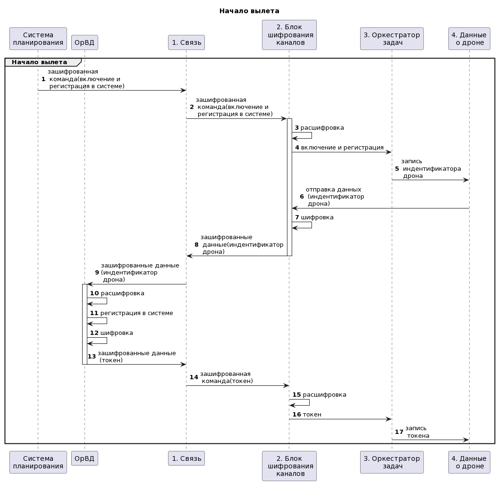

[Cсылка на исходник диаграммы](//www.plantuml.com/plantuml/uml/lLFBQjj05DtFLmnUkGGL-bY5Kl8XWJ1rr4PWZOGzMhIhkFHHQ6XeoRQ5_e5mFSGuiVmBT_wePqOHqdMhKa7fHcXcxZdtdFiucXirCqKw5IOnqrYEw2kLxZsLT4ELfANxY1_hNbCv4a8L9jD5-YoUYHoeP9BaIXjWljFQBH1awPRAOqqxW4hQulQSAbhU_L-Ef9hBv_by3_qDKL_eAhmgamh-_E2-1F_INTArkmWnaonD2vrCb4aopOCV8lYpbqwROotT1sHzmpNWcZR-K5kaPKrvbkHd-xOUWGpQ46wzE_oLy5YvSyzn3VpAbohWJvLH9qghwSjNCITv39Aha6-BMbf0VLrNGTIMR8sUPJe-yHn2l9XbHIvxko1GlkWfBy5XKFEBMJXix5Pq6wuWU8pN3TsuJw2tlYHa9QqH1gIb7-1ehBxpvK9owHQTzjfxWYNtOkhY7HpyTo5rOjbgE9G1iM0QqEvEAEiL5FzEHOy6qOM2gjEusZhj0kJ2crq7c-24NcZ1UTFCZz-HTWPAqT8mArGXVEV3QnE0D8Fate9X_ASSB4DFgVQAn1ihdqHDQ1JrTROPwLLx7AAA9uGsh7__67bsmBkPXoG3zrsAlYbX8NyxXWpKnyXN9XhWK8wz6N31Ok_g3LeyHlWlLgZb6x8WBGhSiJuLuWZV8ft-1000)

#### Инициация вылета

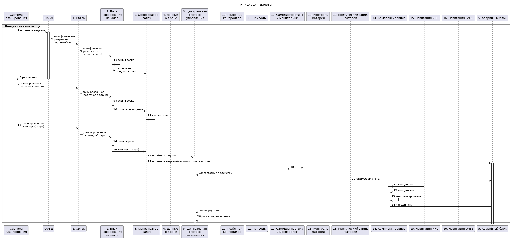

[Cсылка на исходник диаграммы](//www.plantuml.com/plantuml/uml/hLRDJjjC5DtFKrYiWX2VFYX55OkANNVTi4MAJ70Jgx4JEGuINH5eIokGKYeMg59RiUdQ3N4nAPXNc7cZdZCsaSTAIOFOc67cd7D_xjmxMU-4TX1slQO8tR3fM7FoJDx8HBsNYOpuLNrB3jIH_2rZjI-ZEI7iRjZokzwM4uWsk6xDRTj-2EOvq3s0OdajeqrVte8KQRKzcSf1lkxFMNR7UjNkbDZVWFeiJ_Mf7Nh2F5xwpuB-GFNbfJhMc5hByxg-MxD3j-MRu6M0Js0ybQDDtr8VOFMjwGEsvKZ_4sdS89DikEr6EQmd48DlWCUC3gi8CQPgZngNu0-nSQZvstPeLstVRkw-SKoH5OYSQdito6LCQch98Pt2NfonWvRlLAbXSbV1_I5ZC66S_gfZ-gs3K3qpvvOwaBSQDM352Wdtu5Uz7DlI_z3-BbDeda24lbsXS2FiQ6iyqPNVqngiVDjjjiAIoX9LW4vWDKLKHnhTSOATLiSgOPTr8IDvJIGOaRo0bwaE8c5DO3-nU4pdcMaAOtsXHHkEtGmRrLh3gRqkARDGNugUgsFc-QUkLuIjM2PQOyiEGoVOBT6VaKvRT4GTijfo1CjNh3Bek7h3U_MgjS25djqi2Q_aVbsp8K0QGJXl2OQOLz-tTqgyf-1zrPLCaADnCvvXyrnJNBzJegnEfBnukR6X2NM_KsBGnYV06Gv2pMu0OzJDeqcEvmHrnw_j2b4FMjssDML22BIsjVYSFRomi6OXwF7rmYeUzqmMkm0CQBERrpIetBSP7oNGz_kI1G0avZOsJTcAUiVJUM7eqb3Uuuzf8bCqnCbNFKCULxi0DMR5sapsyemXpOkBavWimAmfdLQbwMbycEmZf6wQZI9wGk9xqCTyemqhox2C7fJ14LkSMxHTqVECKsD_-XsSNV4nydQFV3bdTuy7-ddcT8_7np-GAvmZg4XALooPc7YyUCIdNCB7VEh2Xl4eiAGwadrre7gYU5I8XAZiqS6tdrdFh0sBJweeZtOZ8jDKPVnC_ChwS5vWG8F0qSxWTSBvcWtvdcdQaU18pZ5_GU3404nyH_844cowUAzcdWoCaSamaGCAsF4zEsHLc38s3rA5ln_lVd08nzyMw_XqlUOV)

#### Следование в район мониторинга

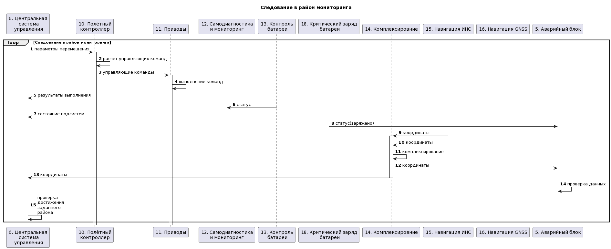

[Cсылка на исходник диаграммы](//www.plantuml.com/plantuml/uml/dPM_JXj14CRxVOgLgqI8AEGFYYWYkdHfQ2sXmpc15NjjsGSI7GSYA3AAaowA54KqgI_c3Ww3pwym-qRvPh8-xbQO8Ws2sVb-ysU_FJQ7KJ28zhiT5RMZJgWRT46tb55A1KqeeHdbb6cQQ7k4lsuGdMcweu8Fx34L2EVu_PAIXbB1VjGp-zsTSA3weBPRxNvW8jrOVwRfDw0pUooOMtiEJMB7JQDj350CL0Pime4JcalMH1hXEkE63eQw6vXWrqUlFGVx5nLWVWDaPaTqqpGqfS9Lmmbpx94mkCD-kzEBFCeQKsIM2HIf7KdsC1mSz8RQots1t0jAP0if50ccdr4XG-GqvI4eVt190jqBWqwqjztQ2riVFV9Ba7zKExVdM0ZzeGIK1A6CSc7i154K3Wuz-HkMSorkn9vXw9Ycg7oZwPhbTapfexpjrg0DNj3nmAzSNtSqbpkPygL1pXOHWmZ410UUxZLqF-KcStQ8_SHtgUaxWXSYQPkX9rb_KFBk_TQM27RDq5DmZQz8npWywZy7y8otQ6ygeh0R3dP3qpfKgjFhzVL_Mrmv2-hLj_TEMbdPq3IN-ko9ZE_EZZYKoOOvz7bXP5NAQemDgGq7dR6BQq_0ZkqNw7DxgiNLTz9nMWCvewAJ1wMKrQHsf9onIoKcc61lS_OSKZAtasK5eNERaCOpkaPPc9LTXV577isDhfpBKBRs2C28dVB4ngfwf6kLOlV82Zjs3KgDjFe9KRwL6L4Qe5xgIVaihgJ9ugc28La0A_CoUNwv_rGS8BCfjg3BMPA1atg2_suglbiaLtjy3EgsiRgw94sL76zmchl2S2MKYOOCFV1xiQUbiQlxzXLDGsdvcRjQN2kYsE82XlnBAfhc_YbHeaBpGMtY1_xB_0K0)

#### Работа в районе мониторинга

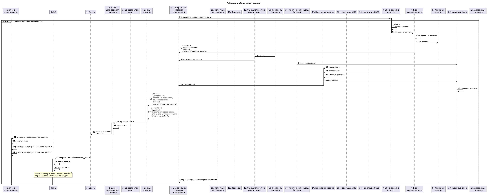

[Cсылка на исходник диаграммы](//www.plantuml.com/plantuml/uml/fLPDRzj64BtlhrZuP2DHKQTfaWf5aLjllUHgG61anY8gaO986KXFLjqqBMpKJP53KQ0VERHdIYMZZrZINzZzHvqtN5FSDLMepKMWkFFUVBoPuJwE4s-G37jTaGH9rvTxwW-Lgh5QwQzLAjL4wZFwFrShjLIvLDVyCAF35HtCwFblbUu9uGsJA1psdle3qIU-e1tqlJ0XjZTaF2BpdA3fKQZMwfrAcUACg2Rc-MfFUh5yreyTz6zazPDwpQTUqXFsyU47alWd-afDzINRjADURnW6RIy9ej0slaV6hyZvIYsEGgc_8w_Vs37GQxNWFodRJGhAJj3lk6bzH6I8RQ5oP8SQ5IK1nvJm6RruoVXZB_5QNkXrdt_bsoJtYUGr-rlg2vK3kf8g8p8kTe4UHA7V0eUDVK3OlwYeIpX7lFeISNCIUcJNNEfpjMQh2UMLLmhUexXEtDmEFoJktzMAE5yH2MARat0BUiFUS08UVSOSKBuVTAF4OJa42_V8X12Plc3hs1-SHh5qRE-na2btLqQ8bBfggLQSn0oQaFzPRVCnQSVtkacdrUxuxIyTPWZrIpLoVOawZrclb5xbQiOSJxqayGVF7VWZmE4BWUYNK5ijoFESL0QSMY_xLxvMUn0GdzTrYE-RkAxLcZLP4B4P2QHer0-zKmVtCU5-PILdc3pzBRIKwcTw-OOXGHWxa0UraC-_UFA40ITXx20UiHfZ55cYx6OY23ub7RARZjKl6DyVH6q_ZeFmn6PvM9qthjRtAAE-aBSeZlrdhJY91jIBDiSdnF4dEXVpKDIb9e9QA0hr8sQREsLUj364ueWOv_VymOaVjbtH7zP0UJhNLZjR5AsRnXPcfcJZiqffxjnfIW8kgFz-e3OokKZkbxTgXZdTibj5DuhwydyiPR7nRiVIbErItAFGajUInYQeYjHe81yz8f8NjZesGGNYC3IT1Rm3kaJM-NMDZGYDHbEYQENwurN2i-luDqvnc5N_xhD4KtsEpO7gSmVNL_n023Fr58Arb12q0P_haQWULQ8rgOsOzUgc96kqMtMb2tUrWA9iHDlLVhcctdAfLWU25WG0j5eW8gzrv91n5foUm4emDbiiwCGsiFQOhIgCxH2tSjhIrPk9aiSbNHk_EN-OKqj9Qout7rKkGMPzW_VhlDwbWvt4kRkzlPZUzlRVskj0R0Atqq0I11bNF_65jqNLuJNUW2qhRWu8iVY-6a_fvlgHSgmKrfMitk4GtPOh79DBC15Z3egIm5pZdFZDpGhRn1rJLprZMa7P6mG8OLt-vAUDZOFcxfhOB718jzBQ0BTl4JjsmXkQfWHSZzp8Tp2Hjni5H_MjOXD2E3G5cUQu1K4hLchtrhjT52_flLTH26zejcLicTGlZ2ZnPNHARG5JmH_cAIV0ouvZGN18ssm77fDtnNbHXtLvqKq5jo-NPMn_bfP5zT3EZ5pIyPonUaHM6Uw4mW-F9KAoLervhDbEMCz4Hw_A-sHnIeKeexl6v66_5FpYCVqCUzr_0000)

#### Финализация задания и завершение задания

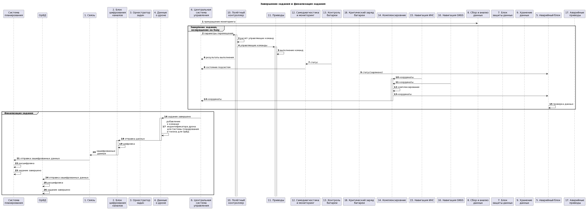

[Cсылка на исходник диаграммы](//www.plantuml.com/plantuml/uml/fLRFRzn45BxFNp7g2LI2I2bjYH3gZHkNNYkjNCVTjTYrLxQtKZdjafI0DY8KLG8X0Qe4d9sjJPqbyVuBC_yHttjsPprJBq7Y4cLdtlUzx_ruptC_pRmacqt68WkpSI1lg1zLhbQgr7FzZIhLbQfKATLh71Ogfv_wJAfAwcDSNE7aRrNHhVwQRsp36q9uiooEPfD7GIAcS1JwuTIBChXv2OE5_WekBbN-C58RC3MmkQhLob18BvMFfwc3_XLMFwWNVEjb4s5VxxylmR_IP-grFcKRFvvCPb7eUraOHxRnBHW_X_DQhHz64a5N-jZMW6ErvXyvswqQob4u7RbXVGWoQ8DvIT7XlnmnrdfE76rkz0dZ3xtC6tYHDtxwPM2Jt0R92_PtfPUg96WjLK6YS5Osw2IEWW5nsDWxmFv9TMFdqAjFIJS7eHTspgK-KXksMY6kifFm2NGDtTZsFm3tRwe6vtEGaBOB56wD4_P6DyIZvyn1bP-6upXpMFQ91TOLlDQ8QidMQP0yYLFfsDxYGkQG2qiWSlKAAciEegAQm7yb-Ph4SwQvBrynwIZmnjbeu8y2_mk7cGhrSrUvFgKydtEzSXoLgcAEHrwM1SbJ1twFuEIBXEWJgZRaLEg2gWmuMg_uLxw1duJWyyOEyUrMroKFHAdMUc56WcUHIIBlYOFx2BXVk98LScJ6yISSlcH86AKEv4ulvBFF7pnWm31A7SGzhiOv9PbM0A1c0Q0EnPkErSyOFqrYFqZJC1hQB7UxyyRP-fRIg9VoBOh3uF4WpU84lMXpV0oEF_ISpTiTrQEW5qg9-fvccplbecbZAXGhObmm2P9X4FbkqUywK3ET6wkTBOh1cyOMxKp9lKyxgJbWCDTvpfbee-djQPKBCKpYsLHkbtIuOqU_HxgW2AShbnfLuyx4TZpgoZ8JU_CcwU8uQVPAcX6zfAEInUA8-TYJC32Buq2osuK-eMrXhHfzfh_ZeZ-Jl3qkMNHX4pLvWv9Ug2ejg5wAndwBH0Ghr6V3MybqoKw7mBMPOE4bvOQM0aylDwV3ng6BTfhXrbesu5Yqo2Ez4DqhQNbQjCkircUjGFPHT5UrS5S6KPW6irszOzRFNoooVbTWy06WbS5bHVpSKGNt5CScQDHRcnqMkB4CUlTJteJ0nhR4tPmc6NjxEyo4uN59D-oNnm38tDeV8eWEpRJy_X_UAfr1w7nSaJBBZkVCUI3LOcjleu4jeF2y-uLjDiRQQaG-Ouq56V4tvRZvmBNpds-__pdP5ZGAilk8uldiVqCnkIGcC9P4OGZQTvGJ0Jzjg2GSVWraEu1lfxarxQ0Ex3SK4C9wVSbFzhOEcknQ0ElTKsn_EYnmY6TXdxn-GeYrbGFTafXLvUYsJAxl0bSVFKp_XpwW3Kc_FilaUdqy4lVn1w_zVm00)

#### Аварийная посадка

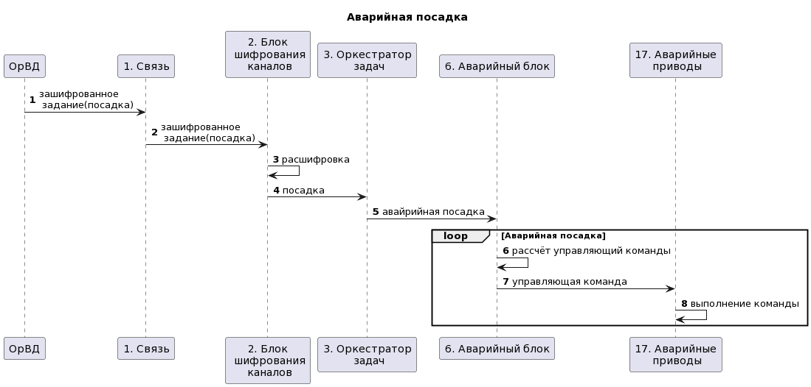

[Cсылка на исходник диаграммы](//www.plantuml.com/plantuml/uml/fPFF2jD04CRl-nHBJtfGK46X1-c326LDWmqacv1iX7fggb2bOgnu5do361hwfpPzXPatSdO3jTC6BrxADlc-ttxpJJlAZ4fD7eN212RqvG2-GWqLpc47UpZHgPHmXXOBg6031wW6GgZSn3gFNlkfICWTU46Yj27l3_9zW-y3gJAfJ2JuwoUF9Vo46alOucUdyU8eodNWAHF4cekVadWDHsZXy4fB_0Wx_43qrgQ34tqhwR7DOqCwNTqXfq4olGtsZ62KZUGD5hYWKuKB6cfk6LitMOLBvvyeeyPAgt3spkUGvmHXvU0AzX9-TI6TsO_yz8sllTdDu2zwh8sz--mUr0JOu8eZnfcVleqpAOIWAkMZbxojeGj-ryk9JitLLBOgQ1xm5JuK3ENONMt_IUqWZEUwBXYHj5TIrlXGSYODV_sQv7yB8ctbykt_yMiLOHmdhFn-sONAhhZ4Bt29Qrn8V6zNvkuzOebVy9D5IaAqyDlrGdkyXV653diO58WnN21kwqL9g75b9u4ZsPfkBNTfz4ICw8F-v7y0)

## Указание "доверенных компонент" на архитектурной диаграмме

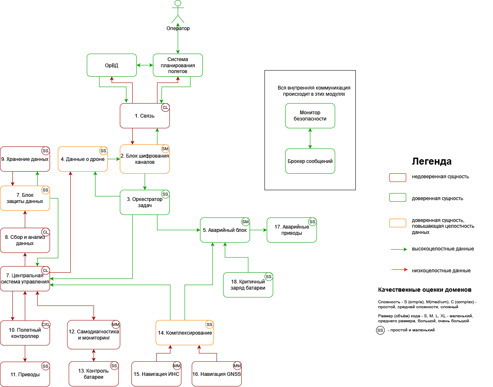

#### Таблица доверенных компонентов

|Компонент|Уровень доверия|Обоснование|Комментарий|
|:--|:--|:--|:--|
|1. Связь|$\textcolor{red}{\textsf{Недоверенный}}$|||
|2. Блок шифрования каналов|$\textcolor{orange}{\textsf{Доверенный}}$|Соблюдение ЦБ 1, 2, 3, 4, 6, 7|Смотри Негативный сценарий 2, 3, 5. Введение такого модуля позволяет нам изолироваться от Среды передачи данных, убирает возможность реализации атаки Evil Twin, Человек по середине, любую прослушку данных в каналах связи и соотвественно не дает изменять информацию от наших систем. А так как системы доверенные то получаемые данные от них автоматически авторизированные и аутентичные.|
|3. Оркестратор задач|$\textcolor{green}{\textsf{Доверенный}}$|Соблюдение ЦБ 1, 2, 3, 6|Нужен для реализации аварийного блока и данных о дроне.|
|4. Данные о дроне|$\textcolor{orange}{\textsf{Доверенный}}$|Соблюдение ЦБ 6|Смотри Негативный сценарий 3|
|5. Аварийный блок|$\textcolor{green}{\textsf{Доверенный}}$|Соблюдение ЦБ 1, 2, 3, 5|Смотри Негативный сценарий 1, 4, 6, 8, 9, 10, 11|
|6. Центральная система управления|$\textcolor{red}{\textsf{Недоверенный}}$|||
|7. Блок защиты данных|$\textcolor{orange}{\textsf{Доверенный}}$|Соблюдение ЦБ 4, 7|Смотри Негативный сценарий 2 и 7|
|8. Сбор и анализ данных|$\textcolor{red}{\textsf{Недоверенный}}$|||
|9. Хранение данных|$\textcolor{red}{\textsf{Недоверенный}}$|||
|10. Полетный контроллер|$\textcolor{red}{\textsf{Недоверенный}}$|||
|11. Приводы|$\textcolor{red}{\textsf{Недоверенный}}$|||
|12. Самодиагностика и мониторинг|$\textcolor{red}{\textsf{Недоверенный}}$|||
|13. Контроль батареи|$\textcolor{red}{\textsf{Недоверенный}}$|||
|14. Комплексирование|$\textcolor{orange}{\textsf{Доверенный}}$|Соблюдение ЦБ 1, 2, 3|Смотри Негативный сценарий 6|
|15. Навигация ИНС|$\textcolor{red}{\textsf{Недоверенный}}$|||
|16. Навигация GNSS|$\textcolor{red}{\textsf{Недоверенный}}$|||
|17. Аварийные приводы|$\textcolor{green}{\textsf{Доверенный}}$|Соблюдение ЦБ 5|Смотри Негативный сценарий 11|
|18. Критичный заряд батареи|$\textcolor{green}{\textsf{Доверенный}}$|Соблюдение ЦБ 3, 5|Смотри Негативный сценарий 12 и 13|

#### Качественная оценка доменов

|Компонент|Доверие|Оценка|Кол-во входящих интерфейсов|Комментарий|
|:--|:-:|:-:|:-:|:--|
|1. Связь|$\textcolor{red}{\textsf{Недоверенный}}$|CL|3|Апаратно-программный модуль который отвечает за приём и отправку данных, может быть реализован как и радиоканал, GSM связь, 5G, спутниковая связь и т.д.|
|2. Блок шифрования каналов|$\textcolor{orange}{\textsf{Доверенный}}$|SM|2|Программный модуль реализующий в себе криптографические функции|
|3. Оркестратор задач|$\textcolor{green}{\textsf{Доверенный}}$|SS|1|Программный модуль занимающейся только первичной инициализацией и отправкой команд в модули|
|4. Данные о дроне|$\textcolor{orange}{\textsf{Доверенный}}$|SS|2|Программный модуль сохраняющий в себе индентификацию дрона и добавляет их к отправляемым данным|
|5. Аварийный блок|$\textcolor{green}{\textsf{Доверенный}}$|SM|3|Программный модуль отвечающий за аварийную посадку дрона, снижает высоту вниз с заданной скоростью, проверяет данные высоты и полетной зоны с координатами|
|6. Центральная система управления|$\textcolor{red}{\textsf{Недоверенный}}$|CL|5|Апаратно-программный модуль содержащий в себе кучу функций|
|7. Блок защиты данных|$\textcolor{orange}{\textsf{Доверенный}}$|SS|2|Программный модуль реализующий криптографические функции|
|8. Сбор и анализ данных|$\textcolor{red}{\textsf{Недоверенный}}$|CL|1|Апаратно-программный модуль содержащий ИИ, камеры, лидары и т.д. для выполнения мониторинга|
|9. Хранение данных|$\textcolor{red}{\textsf{Недоверенный}}$|SS|1|Флешка, SD карта, eeprom, HDD, SSD и еще что может хранить данные|
|10. Полетный контроллер|$\textcolor{red}{\textsf{Недоверенный}}$|CXL|1|Апаратно-программный модуль занимающийся управлением движения всего дрона, может иметь ИИ, наличие доп датчиков для определения движения и тд.|
|11. Приводы|$\textcolor{red}{\textsf{Недоверенный}}$|SS|1|Сервоприводы и драйверы|
|12. Самодиагностика и мониторинг|$\textcolor{red}{\textsf{Недоверенный}}$|MM|1|Программный модуль опроса компонентов|
|13. Контроль батареи|$\textcolor{red}{\textsf{Недоверенный}}$|SS|1|Аппаратный модуль считывающий батарею|
|14. Комплексирование|$\textcolor{orange}{\textsf{Доверенный}}$|SS|2|Программный модуль занимающийся комплексированием координат от двух систем навигации|
|15. Навигация ИНС|$\textcolor{red}{\textsf{Недоверенный}}$|MM|0|Аппаратный модуль инерциальная навигационная система|
|16. Навигация GNSS|$\textcolor{red}{\textsf{Недоверенный}}$|MM|0|Аппаратный модуль спутниковой системы связи|
|17. Аварийные приводы|$\textcolor{green}{\textsf{Доверенный}}$|SS|1|Сервоприводы и драйверы|
|18. Критичный заряд батареи|$\textcolor{green}{\textsf{Доверенный}}$|SS|0|Аппаратный модуль считывающий батарею|

### Проверка негативных сценариев

|Название сценария|Описание|
|---|---------|
|НС-1|Тест Негативного сценария 1. Модуль связи скомпрометирован и пытается изменить данные, что приводит к измению пакета из за чего Блок шифрования данных не может его расшифровать, ЦБ не нарушены|
|НС-2|Тест Негативного сценария 2. Злоумышленник начал прослушивать данные с канала связи, но не смог прочесть данные, ЦБ не нарушены. Аналогично для Негативного сценария 5|
|НС-3|Тест Негативного сценария 3. Модуль связи скомпрометирован и пытается изменить данные, что приводит к измению пакета из за чего ОрВД не может его расшифровать, ЦБ не нарушены|
|НС-4|Тест Негативного сценария 4, 6, 8, 10. При компроментации модулей в этих сценариях, дрон совершает аварийную посадку, ЦБ не нарушены|
|НС-5|Тест Негативного сценария 7. Злоумышленник изымает модуль хранения, но данные внутри него зашифрованы, он не может их прочесть, при попытках взлома модуля, после 3 попыток он стирает данные, ЦБ не нарушены|
|НС-6|Тест Негативного сценария 9, 11, 12, 13. При компроментации модулей в этих сценариях, дрон совершает аварийную посадку с заданной скоростью не более 1 м/с, ЦБ не нарушены |

**Негативный сценарий - НС-1:**


[Cсылка на исходник диаграммы](//www.plantuml.com/plantuml/uml/rLF1pj906BplKspmyXki2Huv4Dv3F5Ieq8HkcxAz0r5YeWd1UF2YnZVOW9lM5kehVFj6pcvfOj74wCcVX8LytypipAGThwIVoYnQCXdAPS1xzDcigQOZQVoMf3Xz94qdKcPB1SONB4zKSxCnEomkf80hp9uFUepvcOn55ZqFKfP0Dfo6YIyaHBzG0S8MX3EfYQ3lL942kMWkk_xVzxY_uY-IrGtx4r3lwBtR-Z9YtVNWCOV-qUmfDsyTPXf7KIR2gI_3MF07QJ3hCfw0SO23cig9uEOrhdxPDOAn3M_ZETonqLs4oGBPy9cdSPPm-k3WEpIZSDeQOEGDA1fX5KCKxesivtv_o96wfieSiB8jQauvvBysTv9cW07TTJzqe5yiEZvCOgGenwa1qNQCOLVsphoosuUisuhtrFRoRDI6QktXUxPKfFXcHufA6uPTOPOtJuD0T9WNqiwAsTmuhHvnf8L6KsVvaoA7kHntQMUpegBDZz8yR_YRQBREloteJvt_zwNyI-QozMk3tjaN3-YrsTw3Pu2nGCpO64SMBNy0)

**Негативный сценарий - НС-2:**


[Cсылка на исходник диаграммы](//www.plantuml.com/plantuml/uml/vLTDRzj64BtlhrWu5nknYiPDarGeYjnwwoN7fX0OcP68IgH0qWRIarKtSGiRLLFaK1HeqXpQCsr94QNeuo_i_gFE6r8qTqCLAdpinPAryzw-cJSxN3wCOYUCZxeT4NjnnvKxweq-KKjrfSRqELE9L0irLaELwEzLIZylQ76ebbBtzGjQMAY4ub8za0SxGZX7SU0VTP-ueUWHhTVqUeuV4-bR2kaJmrZDLVBOLolrNYK4JlFDik-37Ub4ycalij2lAUfNzOfNdRWhR79Q7giHjAvODl-ZprGgrOYf5_fSFsTu5Bg7Zhn5VosMEnz9Kdcb1sgYBpYq6NIxHxxNT68lyCtW0mf-IIairUonB_MFfFq7CnFw6TL3VJZkAgDiUxssNPnFYEmr5tkC6j4tr7gfJy0n8Jmdm_X39tOQZkzqddtdcYHtYUJLEbSr1dH9sKCK3CpGOU2x3N2Os7k4_HjUOdFerHVGpKdelkcSrATgnL5NbDUuP5kNTBNitEvyJDnlr98uNn89j4t9_XbKOJUiW4UVC0Vwf-TrWjXYWJdeIpJWah8wpxnqm-CWabRi0HkPg3aY2P6e8PgMaqZX2UsVIYn3F5SQn0irPDAswtJYTgFPTflVMimmwlUoSds1Eb-oNmdtNSeSJvmuTiDd5lm1uDWBGlGPt2OvgPh2PO9Jwut-bQ_H33tYSpeMyTrSrrojs9CPcyRjY1HpzttdsC9zIhW_sCcK3_WBFiVgD_hnBKCyFx8WzoeXNtxrw143Mdva8Hwm6vSeiaJPynD1y0dvO9_ENXWqtIZo_9R9ShzythXQFw6C-lp30txeFcr4SH1IBveSdn77N-XS7cXSbme5bL0KwXUSRUwKQTR6C8eLCSxjkc7BzPkswVShe7mwLqOx6nIDTMEB_4p9sXUbqjo-NPS4d57__OmsodAHt2_lL8fpMjdUAX6T8EX9zQTAu0YQZ8WarsJAyUDDmElTJIrrsIpCHLObUmrhB8AIIRKQyj5z8dbkkcCIb20MGzqQm5kW2sJLldPmRaAjLfSeMZ7-U9JmsRNtppR5ugZyxovRDD6dc1oeFdTmTSNtXCXFFKamXX94v-1JtHVbfPBQFBK-imxM9LcXtSeZNTYZ1HH58vfRxHPZwXsNQhadQ40G0AC59l9OHmuZpeBJ4nW9USo625en0gmvPhYAO4lY9axBkiemKV3Of2lp5cGuMJwNfOSgbs1aF8DtgtRTfuMjpDdVt5vCR-tsdzfhJrmBDzD04WIvB3_YizrcvGtd-0Lie-pc08dPypNVARc-VYIibMGDPFac27KRBe9CBi64Qn4e2eByCcZfpszMc2RsCRNTur2Oz_MjLkYw_ZS5sfmaG0hZ4YW_NqDgrnlMj_V8OYi9u6jffVJDyyNCYXb0IPzhGihdZEYgvYafmyJJfzdj4iTvNw9fuF8C7xoEHaK33IKawRwX10rsaMrSoWNtTzXmWro8GTQOg5wnBwYs294V7WSiLHu8Yn0rG-jJw1XtFNGaz-Fs1-p_ORKJTszeDJ786XDjyj48gHxsGUpAu9YED485Nwecd0i_g5WBnC7CVBBpY7kVhMVkhegNb4Jmw66pByqhnIBh2OmY855ADMMixbFK2FTvuVg74fACnqJ-jUB9WaThzefOl0jagrI8GjsSfsQV8fXVFAG_zDB-3m00)

**Негативный сценарий - НС-3:**


[Cсылка на исходник диаграммы](//www.plantuml.com/plantuml/uml/PPB1Ji9054NtxojUOAicwiw5uJ_KHOK6cj1fKwPxC8QOQ48qBjoeyGycI4C5gRzmvu-yAIoeRcRcJU-zxxn9EoCRP3QFXs8ZEmorXNS_HeKv2kuhECKh2dp2-HkKlDwWObMfd_Wf2fQEkjBFzBGb4kGsCNby7MQICZRgHcbWB4FVA7h2Sqk3aGOsbkRduoF51-P-XgL_g3NT98vp4tK36oL6srdOQpfEw7Z4cYohIwF-ZWItEsv79lBm6gkwSBLkliqTHEc0TDBFaZnLlDJYAITpN6bJOjpJK71S9pkv7bwq-raOcglp9jcPOWdth_s64L-AaiS5-4RCee0rWNYk_5YngFMaa-QiRCLfsOZFnFWVL3N-DzmkbbUEGGGKIlRGjeOD2cMqyvC_MEi3PMzQbMvkUq54nP8jYChJ6gL8Q7hIuS8_unS0)

**Негативный сценарий - НС-4:**


[Cсылка на исходник диаграммы](//www.plantuml.com/plantuml/uml/hLN1Jjj04BtlLwpIIoj81IsbY0FYrbil79iAcM05gyucSXoataXGGLLGGszLfGfnwTaDDZWGExym-qUTcIp6CQQvz998i_FUpBnzuztk-9RdTvkky1tVjMK5BlGHf3222Fzl8P2GG0HN4EW-n1XEz41_aRgdJp2SOFW8mn6CvDgoN5-M6yjoTQKYXDNrMwhRtBCzqSO2JjrfMygNbVMN4duJKlSH6S2TFcEMOKqXASH8tCVZ2GGKE8OfPutWZZ1uFAn8goERbh8QjYUVUVR-FF_g2XQuW1I9loCJTWlZci91KbCIJuXC7p4HjTbst9PVHhLAL3pV266X7Z2aOtk7hKvP_YlClyHk9vIDg01bIo3baMBI4Xk99HtpA7r8cJo1AoO-i2tNFzYj7zZrJx90_HgfV-Pdq6Ue3_pXQw4xY21caZtBzstlSm6-GN0gHfteKno_X_t4C9PmGt0zXF2VVBjrpq4-ooqGhvc-9Z3bAxgbEpG6IiWOJAAimmBk3U9-ySN6xAqJkbe9Fp1uoH17bKgyNefxztvdXr4DrIc3KRLp61cpZcUke6dliD5RHjfDsslOgbvKxcq9D2AffWLZv2XsZKM4S5kjDdg2fGbPb60cYyI5OMUFwL9BFG61kBTvzGFDz77hmQvBIvlO0dT5Vel85dg08LxRY4DVxrT6PB0Ifatk0prwIWipjt9wgByXIupxpWiquUx3ChhPnDXLAG54SmHw86RvHJpED49zfxoa2RUFs0N5grlIwCIZH723BU1-i97xUl2OaoGHnjWIuVd5GuwUGHxhdfZRoRbAFRFOgHwQDhb6cF-8YUBs44Lca_bIpxDDlEOcqnV2KJc5S8TGNjQ2FHAoItX2mRRFPpwHXoUKrl1iM-KIozVNEBK8olU_k4YcMBNwHBh8-FAeV95fyK4AkJT-Y1QZW_poqaE3X7HrU10IdTdHyqLfvOKAAy--8DckC_FobvQ6Dk-0X9WToGOY0OeS_vrVxJ_-a9Z0OtLh2a93bLMXnvdSUIyyvbz1MbCF7p08kCms_dIRxby0)

**Негативный сценарий - НС-5:**


[Cсылка на исходник диаграммы](//www.plantuml.com/plantuml/uml/bL8zKy904EtlL-o44cEBKZZy3t6S64xC2859GXzHHALWh2mT2_lumN23vdx3xZzoBp2OapHMoUtjUs_Vssl5YHSbetvF947Ia-3WCwMeyHqN_5rX1fZZ0Zymep4gBkUe-QI1hkYMBtA-I57H71gE4Due6OIZ_fcCn91f0pyOUc42pi4-u0k-eQOKK05c1eTVg73P3l6pEESqeua3NWp3QE3BE0x2hitIO9P7HcbSCMh9olUiFAOPx51qvFbfd0mYhojjZaFcUANKj1VJArnKJ509nIUZJTVupNrt_B_6hmh4XUTVogWMoOuGl_E3UrHoqmH_cq4xj5Am7FmXA7bntNgzoT6ZfebjmYOeGS0zhdKZASCJYwa9R47HpMRPsJzODgNgEOHO9s4074QvtVYa1vhJk93Q8fM9W5UPxK3NPnQQCgRAAA-EbNabNACfPdjWdiMECorQCkpm8_y1)

**Негативный сценарий - НС-6:**


[Cсылка на исходник диаграммы](//www.plantuml.com/plantuml/uml/hLLDJzjQ4DtVNt6LjtbFa2S2BMrPLEowwuPbgP09LeYQE95ZaDWHK45LK4DtLQKAiUdQ1HkSxxymzn_rpFW2nZ9XquKXcZldpCpn6T_rJk3umLwpeO9wq71rYIxC8KtfYcBy7rAeQK8nNLDeZYX1U69wvhCsNNE2y0JXGuHZkj9l5dMbWcSPpqf9AMSlQ7bxpMtNLssKg5VhRSSBT6drVqs_66kEW0rfPCw4fx_fWPOIK1_XU4mX1uvfnbaeF68CZlibxNHqq_6SMfwwiWJk2vg2ynj8q2eDDZrCCRNLSC8yvb0ukCDslT4Az3--kvEZgZ2L37S5M6Hw0kcu_dwhKvI_ZFnBD3hcRA12Q3QXgKoJi91e9D5oZ2aGd0hvXAw5UDTr6i7kLdNNhNugeby1_O_C750Dyj1lUIyXGZ4bGhJj187h7nHnl6OEhiejcLFeq4LZ2GqqtJA7wLCqbtIhwjV1vpHon2ziSsEQoMiQWZYnDfgmFOJ4S_Ppk9V0_PINcuZ3JlZrQlgEuAL0wbv7vp2hXPXtxpSs157pEda8Lpb7VchLGMeBddA41eU2SfkkNtEzwa6ksAi2QCmIpNBEo51iMOyerMYrsZ25I1A9664gXyQwYAi7Y4uAJK6XiXRNvRSFJbrOM4DnxaUi5hCRJ0yXMTTOGb_k5aKz6BpyWVtmCSEq9Xt0dgUyAuyMpVJDLx0as7FPdR7q7HNHfREYgq82YhC4K4gb-Ndy6WI1iZFsDH9ZgzByuf35AiIZ07IB5h0MR5t8qYlWX2JAMlcXXUpcWQbhySUcgx97Tu1irQxTxwdfsvQbNfJzZAdyxZ1HpNTT3rJtfdbS-5yHybOsyaPQ3nUrhHNII7wTwUMbr8VJz5ECCrZiFyKx0ssmRM8MQ2YkYiHNeepY9R4vJsJW99jGlDhMpNV9cMdcabhzokKdqjGzpnDIqIn_HKNIYrnDpwF3x4BpnGD2bXG74TFPlJr_Bcr-8ViP49UmJ3VtjaPWA4FRoq5J8buLEx40UOw_pk_joBEEFxZv_m00)

|Компонент|Соответствие|
|-----|-----|
|1. Связь|communication|
|2. Блок шифрования каналов|chipher|
|3. Оркестратор задач|data_analyze|
|4. Данные о дроне|drone_data|
|5. Аварийный блок|emergency|
|6. Центральная система управления|manager|
|7. Блок защиты данных|def_storage|
|8. Сбор и анализ данных|processing|
|9. Хранение данных|storage|
|10. Полетный контроллер|autopilot|
|11. Приводы|servos|
|12. Самодиагностика и мониторинг|health_check|
|13. Контроль батареи|battery|
|14. Комплексирование|nav|
|15. Навигация ИНС|ins|
|16. Навигация GNSS|gnss|
|17. Аварийные приводы|emergency_servos|
|18. Критичный заряд батареи|battery_critical|
|ОрВД|atm|
|Система планирования полётов|fps|

### Политики безопасности

```python {lineNo:true}
policies = (
    {"src": "communication", "dst": "chipher", "opr": "initiate"},
    {"src": "communication", "dst": "chipher", "opr": "register"},
    {"src": "communication", "dst": "chipher", "opr": "set_token"},
    {"src": "communication", "dst": "chipher", "opr": "task_status_change"},
    {"src": "communication", "dst": "chipher", "opr": "start"},
    {"src": "communication", "dst": "chipher", "opr": "stop"},
    {"src": "communication", "dst": "chipher", "opr": "sign_out"},
    {"src": "communication", "dst": "chipher", "opr": "clear_flag"},
    {"src": "communication", "dst": "chipher", "opr": "set_task"},
    {"src": "chipher", "dst": "data-analyze", "opr": "process_command"},
    {"src": "data-analyze", "dst": "drone-data", "opr": "set_password"},
    {"src": "data-analyze", "dst": "drone-data", "opr": "set_token"},
    {"src": "data-analyze", "dst": "drone-data", "opr": "set_hash"},
    {"src": "data-analyze", "dst": "emergency", "opr": "stop"},
    {"src": "data-analyze", "dst": "manager", "opr": "process_command"},
    {"src": "drone-data", "dst": "communication", "opr": "send_response"},
    {"src": "drone-data", "dst": "communication", "opr": "send_error"},
    {"src": "manager", "dst": "drone-data", "opr": "send_response"},
    {"src": "manager", "dst": "drone-data", "opr": "send_error"},
    {"src": "manager", "dst": "autopilot", "opr": "move"},
    {"src": "autopilot", "dst": "servos", "opr": "move"},
    {"src": "autopilot", "dst": "manager", "opr": "set_move"},
    {"src": "manager", "dst": "processing", "opr": "get_data"},
    {"src": "processing", "dst": "def-storage", "opr": "get_data"},
    {"src": "def-storage", "dst": "storage", "opr": "get_data"},
    {"src": "storage", "dst": "def-storage", "opr": "send_data"},
    {"src": "def-storage", "dst": "manager", "opr": "send_data"},
    {"src": "data-analyze", "dst": "drone-data", "opr": "send_response"},
    {"src": "data-analyze", "dst": "drone-data", "opr": "send_error"},
    {"src": "drone-data", "dst": "chipher", "opr": "send_response"},
    {"src": "drone-data", "dst": "chipher", "opr": "send_error"},
    {"src": "chipher", "dst": "communication", "opr": "send_response"},
    {"src": "chipher", "dst": "communication", "opr": "send_error"},

    {"src": "data-analyze", "dst": "drone-data", "opr": "register"},
    {"src": "drone-data", "dst": "chipher", "opr": "register"},

    {"src": "manager", "dst": "drone-data", "opr": "sign_out"},

    {"src": "ins", "dst": "nav", "opr": "set_ins_coords"},
    {"src": "gnss", "dst": "nav", "opr": "set_gnss_coords"},
    {"src": "nav", "dst": "data-gruber", "opr": "set_coords"},
    {"src": "data-gruber", "dst": "health-check", "opr": "check"},
    {"src": "health-check", "dst": "battery", "opr": "get_battery"},
    {"src": "battery", "dst": "health-check", "opr": "set_battery"},
    {"src": "health-check", "dst": "data-gruber", "opr": "set_battery"},
    {"src": "battery-critical", "dst": "data-gruber", "opr": "low_power"},
    {"src": "data-gruber", "dst": "emergency", "opr": "stop"},
    {"src": "emergency", "dst": "emergency-servos", "opr": "land"},
    {"src": "data-gruber", "dst": "manager", "opr": "set_data"},
    {"src": "autopilot", "dst": "servos", "opr": "move"}
)

def check_operation(id, details) -> bool:
    """ Проверка возможности совершения обращения. """
    src: str = details.get("source")
    dst: str = details.get("deliver_to")
    opr: str = details.get("operation")

    if not all((src, dst, opr)):
        return False

    print(f"[info] checking policies for event {id},  {src}->{dst}: {opr}")

    return {"src": src, "dst": dst, "opr": opr} in policies
```
## P.S.

Код весь реализован за исключения центральной системы управления, так как не хватило времени
data-gruber - Остаток от приведущей архитектуры, в решении был использован шина данных и она была доверенной, собирала параметры. В ветке documents если посмотреть коммиты то можно увидеть как это было реализовано.

## Запуск приложения и тестов

### Запуск приложения

см. [инструкцию по запуску](README.md)

### Запуск тестов

_Предполагается, что в ходе подготовки рабочего места все системные пакеты были установлены._

Запуск примера: открыть окно терминала в Visual Studio code, в папке с исходным кодом выполнить

**make all**

запуск тестов:

**make test**
